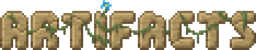

# Artifacts

| | |
|---|---|
| **Mod ID** | `artifacts` |
| **Version** | 13.2.5 |
| **File** | `artifacts-neoforge-13.2.5.jar` |
| **Authors** | ochotonida |
| **License** | MIT |
| **Website** | [https://www.curseforge.com/minecraft/mc-mods/artifacts](https://www.curseforge.com/minecraft/mc-mods/artifacts) |

Wearable artifacts found in dungeons and from Mimics. In this pack, RAR-Compat turns them into levelled relics.

> Adds various new powerful uncraftable items to make exploration a bit more interesting

## Contents

| Section | Entries |
|---|---|
| [Items](items/index.md) | 49 |
| [Mobs](mobs/index.md) | 1 |
| [Effects](effects/index.md) | 1 |
| [Advancements](advancements/index.md) | 3 |
| [Mechanics](mechanics/index.md) | guide |
| [Configs](configs/index.md) | 169 options |
