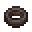

# Withered Bracelet

<small>[Artifacts](../../index.md) &rsaquo; [Items](../index.md) &rsaquo; [Bracelet](index.md)</small>

| | |
|---|---|
| **ID** | `artifacts:withered_bracelet` |
| **Category** | Bracelet |
| **Curio slot** | Bracelet |

## In this pack: relic version (RAR-Compat)

> [!NOTE]
> **Pack note:** this pack includes RAR-Compat, which turns Withered Bracelet into a Relics-style relic. It levels up as you use it and unlocks the abilities below instead of the stock behaviour.

Relic levelling: up to level **10**, first level costs **100** XP, +100 XP per level.

> Fills the relic bearer's weapon with withering energy, affecting all it touches.

Found in loot chests of kind: fire/Nether-themed chests (and ruined portals), any Nether chest.

#### Wither Resistance

*Passive. Ability max level 10.*

Grants complete resistance to wither damage.

#### Withering Touch

*Passive. Ability max level 10.*

Has a **20-40 (up to 40-80)**% chance to apply the Wither effect to the attacked target for **2-4 (up to 6-12)** seconds.

| Stat | Starting value | Per level | At max level |
|---|---|---|---|
| Chance | 20-40 | +10% of base per level | 40-80 |
| Time | 2-4 | +20% of base per level | 6-12 |

## Obtaining

### Loot

| Source | Count | Chance | Notes |
|---|---|---|---|
| `artifacts:items/withered_bracelet` | 1 | 50% | config value |

## Config

Set in [`config/artifacts/items.toml`](../../configs/config-artifacts-items.md).

| Option | Default | Description |
|---|---|---|
| `withered_bracelet.generateAsLoot` | true | Whether this item can be found in structures or drop from entities |
| `withered_bracelet.witherChance` | 0.3 | The probability that the Withered Bracelet inflicts a wither effect |
| `withered_bracelet.witherDuration` | 8 | The duration of the wither effect applied by the Withered Bracelet |
| `withered_bracelet.witherLevel` | 2 | The level of the wither effect that is inflicted by the Withered Bracelet |
| `withered_bracelet.cooldown` | 0 | The duration the Withered Bracelet goes on cooldown for after inflicting wither on an entity |

## Tags

`artifacts:artifacts`, `curios:bracelet`, `rarcompat:mimic_loot`, `rarcompat:mimificable`
