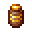
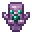
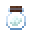
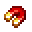
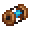

# Charm

<small>[Artifacts](../../index.md) &rsaquo; [Items](../index.md)</small>

| | Name | Description |
|---|---|---|
|  | [Antidote Vessel](antidote-vessel.md) |  |
|  | [Chorus Totem](chorus-totem.md) |  |
|  | [Cloud in a Bottle](cloud-in-a-bottle.md) |  |
|  | [Crystal Heart](crystal-heart.md) |  |
|  | [Obsidian Skull](obsidian-skull.md) |  |
|  | [Universal Attractor](universal-attractor.md) |  |
|  | [Warp Drive](warp-drive.md) |  |
