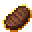
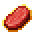

# Eternal Steak

<small>[Artifacts](../../index.md) &rsaquo; [Items](../index.md) &rsaquo; [Food](index.md)</small>

| | |
|---|---|
| **ID** | `artifacts:eternal_steak` |
| **Category** | Food |

## Obtaining

### Recipes

**Campfire** &rarr;  [Eternal Steak](eternal-steak.md)

Ingredients:  [Everlasting Beef](everlasting-beef.md)

**Smelting** &rarr;  [Eternal Steak](eternal-steak.md)

Ingredients:  [Everlasting Beef](everlasting-beef.md)

**Smoking** &rarr;  [Eternal Steak](eternal-steak.md)

Ingredients:  [Everlasting Beef](everlasting-beef.md)

## Config

Set in [`config/artifacts/items.toml`](../../configs/config-artifacts-items.md).

| Option | Default | Description |
|---|---|---|
| `eternal_steak.generateAsLoot` | true | Whether this item can be found in structures or drop from entities |
| `eternal_steak.enabled` | true | Whether the Eternal Steak can be eaten |
| `eternal_steak.cooldown` | 15 | The duration in seconds the Eternal Steak goes on cooldown for after being eaten |

## Tags

`artifacts:artifacts`, `origins:meat`
