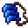

# Digging Claws

<small>[Artifacts](../../index.md) &rsaquo; [Items](../index.md) &rsaquo; [Hands](index.md)</small>

| | |
|---|---|
| **ID** | `artifacts:digging_claws` |
| **Category** | Hands |
| **Curio slot** | Hands |

## In this pack: relic version (RAR-Compat)

> [!NOTE]
> **Pack note:** this pack includes RAR-Compat, which turns Digging Claws into a Relics-style relic. It levels up as you use it and unlocks the abilities below instead of the stock behaviour.

Relic levelling: up to level **10**, first level costs **100** XP, +100 XP per level.

> Strengthens the relic bearer's hands, allowing them to chop through any blocks more effectively.

Found in loot chests of kind: chests in cave biomes, mineshaft chests.

#### Pickaxe Hands

*Passive. Ability max level 10.*

Reduces the required tool level for all blocks by 1.

#### Fast Mining

*Passive. Ability max level 10.*

Increases block mining speed by **15-35 (up to 75-175)**%.

| Stat | Starting value | Per level | At max level |
|---|---|---|---|
| Modifier | 15-35 | +40% of base per level | 75-175 |

## Obtaining

### Loot

| Source | Count | Chance | Notes |
|---|---|---|---|
| `artifacts:items/digging_claws` | 1 | 50% | config value |

## Config

Set in [`config/artifacts/items.toml`](../../configs/config-artifacts-items.md).

| Option | Default | Description |
|---|---|---|
| `digging_claws.generateAsLoot` | true | Whether this item can be found in structures or drop from entities |
| `digging_claws.blockBreakSpeedBonus` | 0.3 | How much the Digging Claws increase the wearer's mining speed |
| `digging_claws.toolTier` | "STONE" | The tool tier that the Digging Claws increase the wearer's mining level to |

## Tags

`artifacts:artifacts`, `artifacts:slot/hands`, `rarcompat:mimic_loot`, `rarcompat:mimificable`
