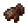

# Vampiric Glove

<small>[Artifacts](../../index.md) &rsaquo; [Items](../index.md) &rsaquo; [Hands](index.md)</small>

| | |
|---|---|
| **ID** | `artifacts:vampiric_glove` |
| **Category** | Hands |
| **Curio slot** | Hands |

## In this pack: relic version (RAR-Compat)

> [!NOTE]
> **Pack note:** this pack includes RAR-Compat, which turns Vampiric Glove into a Relics-style relic. It levels up as you use it and unlocks the abilities below instead of the stock behaviour.

Relic levelling: up to level **10**, first level costs **100** XP, +100 XP per level.

> Grants the relic bearer's attacks a vampiric effect, healing them by a portion of the damage dealt.

Found in loot chests of kind: fire/Nether-themed chests (and ruined portals), any Nether chest.

#### Life Steal

*Passive. Ability max level 10.*

Heals the player for **10-20 (up to 20-40)**% of the damage dealt.

| Stat | Starting value | Per level | At max level |
|---|---|---|---|
| Amount | 10-20 | +10% of base per level | 20-40 |

## Obtaining

### Loot

| Source | Count | Chance | Notes |
|---|---|---|---|
| `artifacts:items/vampiric_glove` | 1 | 50% | config value |

## Config

Set in [`config/artifacts/items.toml`](../../configs/config-artifacts-items.md).

| Option | Default | Description |
|---|---|---|
| `vampiric_glove.generateAsLoot` | true | Whether this item can be found in structures or drop from entities |
| `vampiric_glove.absorptionRatio` | 0.2 | The proportion of melee damage dealt that is absorbed by the Vampiric Gloves |
| `vampiric_glove.absorptionChance` | 1 | The probability that damage is absorbed when attacking an entity with the Vampiric Gloves |
| `vampiric_glove.maxHealingPerHit` | 6 | The maximum amount of healing that can be absorbed in a single hit when attacking an entity while wearing the Vampiric Glove |

## Tags

`artifacts:artifacts`, `artifacts:slot/hands`, `rarcompat:mimic_loot`, `rarcompat:mimificable`
