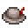

# Angler's Hat

<small>[Artifacts](../../index.md) &rsaquo; [Items](../index.md) &rsaquo; [Head](index.md)</small>

| | |
|---|---|
| **ID** | `artifacts:anglers_hat` |
| **Category** | Head |
| **Curio slot** | Head |

## In this pack: relic version (RAR-Compat)

> [!NOTE]
> **Pack note:** this pack includes RAR-Compat, which turns Angler's Hat into a Relics-style relic. It levels up as you use it and unlocks the abilities below instead of the stock behaviour.

Relic levelling: up to level **10**, first level costs **100** XP, +100 XP per level.

> Increases catch during fishing.

Found in loot chests of kind: chests in ocean/river biomes, village and pillager chests.

#### Generous Catch

*Passive. Ability max level 10.*

Has a **10-20 (up to 35-70)**% chance to increase the amount of catch received. If successful, the ability repeats, adding more catch. This continues until the chance fails, summing all catches.

| Stat | Starting value | Per level | At max level |
|---|---|---|---|
| Chance | 10-20 | +25% of base per level | 35-70 |

## Obtaining

### Loot

| Source | Count | Chance | Notes |
|---|---|---|---|
| `artifacts:items/anglers_hat` | 1 | 50% | config value |

## Config

Set in [`config/artifacts/items.toml`](../../configs/config-artifacts-items.md).

| Option | Default | Description |
|---|---|---|
| `anglers_hat.generateAsLoot` | true | Whether this item can be found in structures or drop from entities |
| `anglers_hat.luckOfTheSeaLevelBonus` | 1 | The amount of extra levels of luck of the sea that are granted by the Angler's Hat |
| `anglers_hat.lureLevelBonus` | 1 | The amount of extra levels of lure that are granted by the Angler's Hat |

## Tags

`artifacts:artifacts`, `artifacts:slot/head`, `rarcompat:mimic_loot`, `rarcompat:mimificable`
