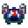

# Novelty Drinking Hat

<small>[Artifacts](../../index.md) &rsaquo; [Items](../index.md) &rsaquo; [Head](index.md)</small>

| | |
|---|---|
| **ID** | `artifacts:novelty_drinking_hat` |
| **Category** | Head |
| **Curio slot** | Head |

## Description

'Hey! I'm #1, and I let gravity do my drinking!'

## Obtaining

### Loot

| Source | Count | Chance | Notes |
|---|---|---|---|
| `artifacts:items/drinking_hat` | 1 | 12% | config value |

## Config

Set in [`config/artifacts/items.toml`](../../configs/config-artifacts-items.md).

| Option | Default | Description |
|---|---|---|
| `novelty_drinking_hat.generateAsLoot` | true | Whether this item can be found in structures or drop from entities |

## Tags

`artifacts:artifacts`, `artifacts:slot/head`, `rarcompat:mimic_loot`, `rarcompat:mimificable`
