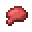

# Whoopee Cushion

<small>[Artifacts](../../index.md) &rsaquo; [Items](../index.md) &rsaquo; [Head](index.md)</small>

| | |
|---|---|
| **ID** | `artifacts:whoopee_cushion` |
| **Category** | Head |
| **Curio slot** | Head |

## In this pack: relic version (RAR-Compat)

> [!NOTE]
> **Pack note:** this pack includes RAR-Compat, which turns Whoopee Cushion into a Relics-style relic. It levels up as you use it and unlocks the abilities below instead of the stock behaviour.

Relic levelling: up to level **10**, first level costs **100** XP, +100 XP per level.

> Mysteriously increases the relic bearer's flatulence, leading to entirely unpredictable outcomes.

Found in loot chests of kind: any Overworld chest.

#### Flatulence

*Passive. Ability max level 10.*

Has a **20-40 (up to 35-70)**% chance to knock back entities within a **3-5 (up to 4.5-7.5)** block radius, applying a 10-second nausea effect when taking damage or crouching frequently.

| Stat | Starting value | Per level | At max level |
|---|---|---|---|
| Chance | 20-40 | +7.5% of base per level | 35-70 |
| Radius | 3-5 | +5% of base per level | 4.5-7.5 |

## Obtaining

### Loot

| Source | Count | Chance | Notes |
|---|---|---|---|
| `artifacts:items/whoopee_cushion` | 1 | 50% | config value |

## Config

Set in [`config/artifacts/items.toml`](../../configs/config-artifacts-items.md).

| Option | Default | Description |
|---|---|---|
| `whoopee_cushion.generateAsLoot` | true | Whether this item can be found in structures or drop from entities |
| `whoopee_cushion.fartChance` | 0.12 | The probability that a fart sound plays when sneaking or double jumping while wearing the Whoopee Cushion |

## Tags

`artifacts:artifacts`, `artifacts:slot/head`, `rarcompat:mimic_loot`, `rarcompat:mimificable`
