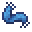

# Scarf of Invisibility

<small>[Artifacts](../../index.md) &rsaquo; [Items](../index.md) &rsaquo; [Necklace](index.md)</small>

| | |
|---|---|
| **ID** | `artifacts:scarf_of_invisibility` |
| **Category** | Necklace |
| **Curio slot** | Necklace |

## In this pack: relic version (RAR-Compat)

> [!NOTE]
> **Pack note:** this pack includes RAR-Compat, which turns Scarf of Invisibility into a Relics-style relic. It levels up as you use it and unlocks the abilities below instead of the stock behaviour.

Relic levelling: up to level **10**, first level costs **100** XP, +100 XP per level.

> When moving carefully, makes the player invisible to surroundings.

Found in loot chests of kind: End and stronghold chests, any End chest.

#### Silent Step

*Passive. Ability max level 10.*

Grants the player complete invisibility. The effect is lost for **7-5 (up to 3.5-2.5)** seconds upon any interaction with the world. If during the absence of invisibility any mob targets the player, the effect will not restore until that mob won't lose sight of the player.

| Stat | Starting value | Per level | At max level |
|---|---|---|---|
| Time | 7-5 | -5% of base per level | 3.5-2.5 |

## Obtaining

### Loot

| Source | Count | Chance | Notes |
|---|---|---|---|
| `artifacts:items/scarf_of_invisibility` | 1 | 50% | config value |

## Config

Set in [`config/artifacts/items.toml`](../../configs/config-artifacts-items.md).

| Option | Default | Description |
|---|---|---|
| `scarf_of_invisibility.generateAsLoot` | true | Whether this item can be found in structures or drop from entities |
| `scarf_of_invisibility.enabled` | true | Whether the Scarf of Invisibility makes players invisible |
| `scarf_of_invisibility.hideWhenInvisible` | false | Whether the Scarf of Invisibility is hidden when the wearer is invisible |
| `scarf_of_invisibility.hidesEffectParticles` | false | Whether the Scarf of Invisibility should prevent all status effects from spawning particles |

## Tags

`artifacts:artifacts`, `artifacts:slot/necklace`, `rarcompat:mimic_loot`, `rarcompat:mimificable`
