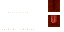

# Mimic

<small>[Artifacts](../index.md) &rsaquo; [Mobs](index.md) &rsaquo; Misc</small>

| | |
|---|---|
| **ID** | `artifacts:mimic` |
| **Type** | Misc |
| **Health** | 60 |
| **Attack damage** | 5 |
| **Speed** | 0.8 |
| **Follow range** | 16 |
| **Knockback resistance** | 0.8 |
| **Hitbox** | 0.875 x 0.875 blocks |
| **Spawn egg** |  [Mimic Spawn Egg](../items/spawn-eggs/mimic-spawn-egg.md) |

## What it does

An entity with **60** health and **5** attack damage.

## Drops

| Item | Count | Chance | Notes |
|---|---|---|---|
| table `artifacts:artifact` | 1 | 100% |  |

## Tags

`c:capturing_not_supported`
