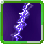

# Purple Lightning

<small>[Ascension](../../index.md) &rsaquo; [Abilities](../index.md) &rsaquo; [Aspectual Magic](index.md)</small>

| | |
|---|---|
| **Type** | Aspectual Magic |
| **ID** | `ascension:purple_lightning` |
| **Max mastery** | 700 |
| **Activation** | Press, Hold |

> Active: call down corrupted purple lightning. Darkness-flavoured damage that bypasses Darkness Attack Nullification. Radius and damage scale with mastery. Intrinsic to Demonic Dragon.

## Costs

| When | Magicule (MP) | Aura (AP) |
|---|---|---|
| Always | 30,000 |  |

## How it works

- Activated by pressing the skill key
- Charged or channelled by holding the skill key
- Triggers when the held key is released

## Obtaining

- Intrinsic skill of: [Demonic Dragon](../../races/demonic-dragon.md), [Demon Dragon God](../../races/demon-dragon-god.md)

## Stats (config defaults)

Set in [`config/tensura/ability/magic/aspectual_config.toml`](../../../tensura-reincarnated/configs/config-tensura-ability-magic-aspectual-config.md).

| Option | Default | Description |
|---|---|---|
| `Thunder.castTime` | 20 | Cast time in tick. |
| `Thunder.magiculeCost` | 30,000 | Magicule Cost to cast. |
| `Thunder.range` | 30 | The range in block of the magic. |
| `Thunder.blastRadius` | 3 | The radius in block of the thunder strike's blast. |
| `Thunder.blastRadiusMastered` | 5 | The radius in block of the thunder strike's blast when mastered. |
| `Thunder.magicDamage` | 100 | The magic damage of the thunder strike. |
| `Thunder.magicDamageMastered` | 200 | The magic damage of the thunder strike when mastered. |
| `Thunder.cooldown` | 3 | The cooldown in second of the magic. |
| `Thunder.cooldownMastered` | 1 | The cooldown in second of the magic when mastered. |

Set in [`config/tensura/ability/magic_config.toml`](../../../tensura-reincarnated/configs/config-tensura-ability-magic-config.md).

| Option | Default | Description |
|---|---|---|
| `AspectualMagic.masteryHigh` | 700 | The max amount of mastery point for High Aspectual Magic. |
| `AspectualMagic.masterySummoning` | 200 | The max amount of mastery point for Summoning Magic. |
| `AspectualMagic.masteryLow` | 100 | The max amount of mastery point for Low Aspectual Magic. |
| `AspectualMagic.masteryMedium` | 300 | The max amount of mastery point for Medium Aspectual Magic. |
| `AspectualMagic.masteryHigh` | 700 | The max amount of mastery point for High Aspectual Magic. |
| `AspectualMagic.masteryGreat` | 1,500 | The max amount of mastery point for Great Aspectual Magic. |

## Tags

`tensura:skills/aspectual_magic`
