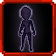

# Image Training

<small>[Ascension](../../index.md) &rsaquo; [Abilities](../index.md) &rsaquo; [Battlewill](index.md)</small>

| | |
|---|---|
| **Type** | Battlewill |
| **ID** | `ascension:image_training` |
| **Cooldowns (s)** | 300 |
| **Activation** | Press |

> Active: summon a shadowy training clone in front of you. Idle until hit; once provoked, fights back with melee that bypasses ALL resistances and nullifications. Killing the clone grants 10%% of your current EP as bonus. Costs 50%% current aura and 50%% current MP. CD 5 min. Lifespan 2 min. One clone at a time.

## How it works

- Activated by pressing the skill key

## Related

- **Summons / entities:** [Image Training Clone](../../mobs/image-training-clone.md)

## Stats (config defaults)

Set in [`config/tensura/ascension-skills.toml`](../../configs/config-tensura-ascension-skills.md).

| Option | Default | Description |
|---|---|---|
| `image_training.enabled` | true | Enable Image Training Battlewill. |
| `image_training.masteryPerCast` | 5 (0 to 500) | Mastery points awarded per successful cast. |
| `image_training.cooldownSeconds` | 300 (0 to 36,000) | Cooldown between casts (seconds). Default 300 = 5 minutes. |

## In-game messages

Show 3 messages

- Not enough aura or magicule.
- You already have an active training clone.
- No room to summon the clone.

## Tags

`tensura:skills/battlewill`
