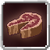

# Magicule Nourishment

<small>[Ascension](../../index.md) &rsaquo; [Abilities](../index.md) &rsaquo; [Common Skills](index.md)</small>

| | |
|---|---|
| **Type** | Common Skill |
| **ID** | `ascension:magicule_nourishment` |
| **Cooldowns (s)** | 5 mastered, 10 otherwise |
| **Activation** | Press |

> Press: refill hunger and grant saturation for 15% of max magicule (7.5% mastered). 10s cooldown (5s mastered).

## How it works

- Activated by pressing the skill key

## Stats (config defaults)

Set in [`config/tensura/ascension-skills.toml`](../../configs/config-tensura-ascension-skills.md).

| Option | Default | Description |
|---|---|---|
| `magicule_nourishment.enabled` | true | Enable Magicule Nourishment. |
| `magicule_nourishment.costFractionMastered` | 0.075 (0 to 1) | Fraction of max magicule consumed per cast, mastered. |
| `magicule_nourishment.costFraction` | 0.15 (0 to 1) | Fraction of max magicule consumed per cast, unmastered. |
| `magicule_nourishment.cooldownSecondsMastered` | 5 (0 to 3,600) | Cooldown, mastered (seconds). |
| `magicule_nourishment.cooldownSeconds` | 10 (0 to 3,600) | Cooldown, unmastered (seconds). |

## In-game messages

Show 1 messages

- You are not hungry.

## Tags

`tensura:skills/common_skills`
