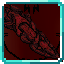

# King of Curses

<small>[Ascension](../../index.md) &rsaquo; [Abilities](../index.md) &rsaquo; [Unique Skills](index.md)</small>

| | |
|---|---|
| **Type** | Unique Skill |
| **ID** | `ascension:king_of_curses` |
| **Modes** | 4 |
| **Activation** | Toggle, Press |

> Toggle: +15% melee damage and Reverse Cursed Technique (1 HP/2s, 1 HP/s mastered) at the cost of 0.2% max aura/s. Modes: Dismantle (ranged single-target slash), Cleave (radial slash ring), Fuga (massive flame explosion), Malevolent Shrine (15-block / 10s aura-slash domain — 20-block / 15s mastered).

## Modes

| # | Mode |
|---|---|
| 1 | Dismantle |
| 2 | Cleave |
| 3 | Fuga |
| 4 | Malevolent Shrine |

## Costs

| When | Magicule (MP) | Aura (AP) |
|---|---|---|
| Always | *set by config (max MP × fraction)* |  |

## How it works

- Can be toggled on and off
- Activated by pressing the skill key

### Attribute changes

| Attribute | Amount | Operation |
|---|---|---|
| dmg | 0.15 | add x base |

## Obtaining

- Listed in the `additionalUniqueSkills` config option (config/tensura/ascension-common.toml): Unique skills added to the reincarnation pool. Remove an entry to exclude that skill from random reincarnation rolls.

## Related

- **Summons / entities:** Shadow Slash, Magic Explosion

## Stats (config defaults)

Set in [`config/tensura/ascension-skills.toml`](../../configs/config-tensura-ascension-skills.md).

| Option | Default | Description |
|---|---|---|
| `king_of_curses.enabled` | true | Enable King of Curses. |
| `king_of_curses.meleeBonus` | 0.15 (0 to 10) | Melee damage bonus while toggled (fraction). |
| `king_of_curses.costDismantle` | 0.02 (0 to 1) | Dismantle magicule cost (fraction of max). |
| `king_of_curses.costCleave` | 0.04 (0 to 1) | Cleave magicule cost (fraction of max). |
| `king_of_curses.costFuga` | 0.1 (0 to 1) | Fuga magicule cost (fraction of max). |
| `king_of_curses.costShrine` | 0.25 (0 to 1) | Malevolent Shrine magicule cost (fraction of max). |
| `king_of_curses.auraDrainPerSec` | 0.002 (0 to 1) | Fraction of max aura drained per second while toggled. |

## Tags

`tensura:skills/unique_skills`
