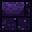

# Awakening Altar

<small>[Ascension](../index.md) &rsaquo; [Blocks](index.md)</small>

| | |
|---|---|
| **ID** | `ascension:awakening_altar` |
| **Tool** | Pickaxe |
| **Tool tier** | Iron |

## Description

Center of the Ultimate-skill awakening multiblock. Throw a Catalyst on it, then right-click to ritualize.

## Drops

| Item | Count | Chance | Notes |
|---|---|---|---|
|  [Awakening Altar](awakening-altar.md) | 1 | 100% |  |

## Obtaining

### Recipes

**Crafting (shaped)** &rarr;  [Awakening Altar](awakening-altar.md)

| | | |
|---|---|---|
|   |  [Slime Core](../../tensura-reincarnated/items/materials/slime-core.md) |   |
|  [Mithril Ingot](../../tensura-reincarnated/items/materials/mithril-ingot.md) |  [Crying Obsidian](https://minecraft.wiki/w/Crying_Obsidian) |  [Mithril Ingot](../../tensura-reincarnated/items/materials/mithril-ingot.md) |
|  [Crying Obsidian](https://minecraft.wiki/w/Crying_Obsidian) |  [Crying Obsidian](https://minecraft.wiki/w/Crying_Obsidian) |  [Crying Obsidian](https://minecraft.wiki/w/Crying_Obsidian) |

### Loot

| Source | Count | Chance | Notes |
|---|---|---|---|
| Breaking [Awakening Altar](awakening-altar.md) | 1 | 100% |  |

## Tags

`minecraft:mineable/pickaxe`, `minecraft:needs_iron_tool`
