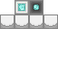

# Magicule Enhancer

<small>[Ascension](../index.md) &rsaquo; [Blocks](index.md)</small>

| | |
|---|---|
| **ID** | `ascension:magicule_enhancer` |
| **Tool** | Pickaxe |
| **Tool tier** | Iron |

## Description

Boosts magicule pool &amp; regen in a 3x3 chunk area. Burns magic crystals as fuel.

## Drops

| Item | Count | Chance | Notes |
|---|---|---|---|
|  [Magicule Enhancer](magicule-enhancer.md) | 1 | 100% |  |

## Obtaining

### Recipes

**Crafting (shaped)** &rarr;  [Magicule Enhancer](magicule-enhancer.md)

| | | |
|---|---|---|
|  [Redstone](https://minecraft.wiki/w/Redstone) |  [Low Magisteel Ingot](../../tensura-reincarnated/items/materials/low-magisteel-ingot.md) |  [Redstone](https://minecraft.wiki/w/Redstone) |
|  [Low Magisteel Ingot](../../tensura-reincarnated/items/materials/low-magisteel-ingot.md) |  [Magic Stone](../../tensura-reincarnated/items/materials/magic-stone.md) |  [Low Magisteel Ingot](../../tensura-reincarnated/items/materials/low-magisteel-ingot.md) |
|  [Iron Block](https://minecraft.wiki/w/Iron_Block) |  [Iron Block](https://minecraft.wiki/w/Iron_Block) |  [Iron Block](https://minecraft.wiki/w/Iron_Block) |

### Loot

| Source | Count | Chance | Notes |
|---|---|---|---|
| Breaking [Magicule Enhancer](magicule-enhancer.md) | 1 | 100% |  |

## Tags

`minecraft:mineable/pickaxe`, `minecraft:needs_iron_tool`
