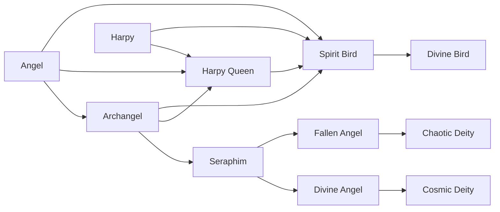

# Chaotic Deity

<small>[Ascension](../index.md) &rsaquo; [Races](index.md)</small>

| | |
|---|---|
| **ID** | `ascension:chaotic_deity` |
| **Difficulty** | Extreme |
| **Alignment** | Majin |
| **Aura** | 300 - 600 |
| **Magicule** | 1,500 - 2,500 |
| **Health bonus** | 10 |
| **Spiritual health bonus** | 5 |
| **Attack damage bonus** | 0 |
| **Movement speed bonus** | 0 |

> A Fallen Angel ascended into a force of primordial chaos.

## Evolution

- **Evolves from:** [Fallen Angel](fallen-angel.md)

### Requirements to evolve into Chaotic Deity

Each requirement adds its weight to the evolution progress bar; you can evolve at 100%.

| Requirement | Weight |
|---|---|
| Reach Existence Points of chaotic_deity (evolution ep) | 100% |

### Evolution tree

## Intrinsic skills

Granted automatically when you become this race.

-  [Titanification](../../tensura-reincarnated/abilities/intrinsic-skills/titanification.md)
-  [Possession](../../tensura-reincarnated/abilities/intrinsic-skills/possession.md)
-  [Body Armor](../../tensura-reincarnated/abilities/intrinsic-skills/body-armor.md)
-  [Divine Ki Release](../../tensura-reincarnated/abilities/intrinsic-skills/divine-ki-release.md)
-  [Light Transform](../../tensura-reincarnated/abilities/intrinsic-skills/light-transform.md)

## Learnable skills

This race can learn these skills through training.

-  [Thought Acceleration](../../tensura-reincarnated/abilities/extra-skills/thought-acceleration.md)
-  [Multilayer Barrier](../../tensura-reincarnated/abilities/extra-skills/multilayer-barrier.md)
-  [Demon Lord Haki](../../tensura-reincarnated/abilities/extra-skills/demon-lord-haki.md)
-  [Magic Nullification](../../tensura-reincarnated/abilities/resistance-skills/magic-nullification.md)
-  [Physical Attack Nullification](../../tensura-reincarnated/abilities/resistance-skills/physical-attack-nullification.md)
-  [Darkness Attack Nullification](../../tensura-reincarnated/abilities/resistance-skills/darkness-attack-nullification.md)
-  [Infinite Regeneration](../../tensura-reincarnated/abilities/extra-skills/infinite-regeneration.md)
-  [Darkness Attack Resistance](../../tensura-reincarnated/abilities/resistance-skills/darkness-attack-resistance.md)
-  [Holy Attack Nullification](../../tensura-reincarnated/abilities/resistance-skills/holy-attack-nullification.md)
-  [Ultraspeed Regeneration](../../tensura-reincarnated/abilities/extra-skills/ultraspeed-regeneration.md)
-  [Majesty](../../tensura-reincarnated/abilities/extra-skills/majesty.md)
-  [Sacred Haki](../../tensura-reincarnated/abilities/extra-skills/sacred-haki.md)
-  [Magic Light Transform](../../tensura-reincarnated/abilities/extra-skills/magic-light-transform.md)
-  [Light Attack Nullification](../../tensura-reincarnated/abilities/resistance-skills/light-attack-nullification.md)
-  [Holy Attack Resistance](../../tensura-reincarnated/abilities/resistance-skills/holy-attack-resistance.md)
-  [Gravity Flight](../../tensura-reincarnated/abilities/common-skills/gravity-flight.md)

## Traits

- Divine

## Attribute modifiers

| Attribute | Amount | Operation |
|---|---|---|
| Safe Fall Distance | 3 | add |
| Scale | 0 | add |
| Max Health | 10 | add |
| Max Spiritual Health | 5 | add |
| Attack Damage | 0 | add |
| Attack Speed | 0 | add |
| Knockback Resistance | 0 | add |
| Movement Speed | 0 | add |
| Swim Speed Multiplier | 0 | add |

## Stats (config defaults)

Set in [`config/tensura/race/harpy_config.toml`](../../tensura-reincarnated/configs/config-tensura-race-harpy-config.md).

| Option | Default | Description |
|---|---|---|
| `Harpy.safeFalling` | 3 | Bonus Safe Falling distance. |
| `Harpy.minAura` | 300 | Minimal aura. |
| `Harpy.maxAura` | 600 | Maximum aura. |
| `Harpy.minMagicule` | 1,500 | Minimal magicule. |
| `Harpy.maxMagicule` | 2,500 | Maximum magicule. |
| `Harpy.size` | 0 | Bonus Size. |
| `Harpy.maxHealth` | 10 | Bonus Max Health. |
| `Harpy.maxSpiritualHealth` | 5 | Bonus Max Spiritual Health. |
| `Harpy.attack` | 0 | Bonus Attack Damage. |
| `Harpy.attackSpeed` | 0 | Bonus Attack Speed. |
| `Harpy.knockbackResistance` | 0 | Bonus Knockback Resistance. |
| `Harpy.movementSpeed` | 0 | Bonus Movement Speed. |
| `Harpy.swimSpeed` | 0 | Bonus Swimming Speed Multiplier. |
| `Harpy.safeFalling` | 3 | Bonus Safe Falling distance. |
| `Harpy.flightBoost` | 0.75 | Flight Upward Boost Power. |
| `Harpy.flightCooldown` | 3 | Flight Boost Cooldown. |

## Tags

`tensura:races/divine`
