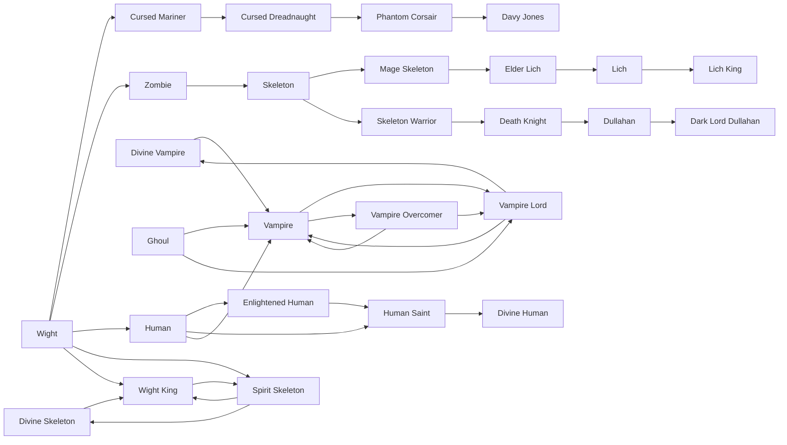
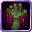

# Dullahan

<small>[Ascension](../index.md) &rsaquo; [Races](index.md)</small>

| | |
|---|---|
| **ID** | `ascension:dullahan` |
| **Stage** | In-between |
| **Difficulty** | Hard |
| **Alignment** | Majin |
| **Aura** | 100 - 500 |
| **Magicule** | 2,000 - 3,000 |
| **Health bonus** | 0 |
| **Spiritual health bonus** | 0 |
| **Attack damage bonus** | 0 |
| **Movement speed bonus** | 0 |

> The headless rider. Physical Attack Nullification and a spectral Skeleton Horse.

## Evolution

- **Evolves from:** [Death Knight](death-knight.md)
- **Evolves into:** [Dark Lord Dullahan](dark-lord-dullahan.md)
- **Default evolution:** [Dark Lord Dullahan](dark-lord-dullahan.md)
- **On awakening (True Demon Lord / True Hero):** [Dark Lord Dullahan](dark-lord-dullahan.md)
- **During the Harvest Festival:** [Dark Lord Dullahan](dark-lord-dullahan.md)

### Requirements to evolve into Dullahan

Each requirement adds its weight to the evolution progress bar; you can evolve at 100%.

| Requirement | Weight |
|---|---|
| Reach Existence Points of 4,000,000 | 100% |

### Evolution tree

## Learnable skills

This race can learn these skills through training.

-  [Physical Attack Nullification](../../tensura-reincarnated/abilities/resistance-skills/physical-attack-nullification.md)
-  [Magic Resistance](../../tensura-reincarnated/abilities/resistance-skills/magic-resistance.md)
-  [Create Lesser Undead](../../tensura-reincarnated/abilities/spiritual-magic/create-lesser-undead.md)
-  [Strengthen Body](../../tensura-reincarnated/abilities/extra-skills/strengthen-body.md)
-  [Poison Resistance](../../tensura-reincarnated/abilities/resistance-skills/poison-resistance.md)
-  [Pierce Resistance](../../tensura-reincarnated/abilities/resistance-skills/pierce-resistance.md)
-  [Paralysis Resistance](../../tensura-reincarnated/abilities/resistance-skills/paralysis-resistance.md)
-  [Pain Resistance](../../tensura-reincarnated/abilities/resistance-skills/pain-resistance.md)

## Attribute modifiers

| Attribute | Amount | Operation |
|---|---|---|
| Scale | 0 | add |
| Max Health | 0 | add |
| Max Spiritual Health | 0 | add |
| Attack Damage | 0 | add |
| Attack Speed | -0.2 | add |
| Knockback Resistance | 0 | add |
| Movement Speed | 0 | add |
| Swim Speed Multiplier | 0 | add |

## Stats (config defaults)

Set in [`config/tensura/race/wight_config.toml`](../../tensura-reincarnated/configs/config-tensura-race-wight-config.md).

| Option | Default | Description |
|---|---|---|
| `Wight.minAura` | 100 | Minimal aura. |
| `Wight.maxAura` | 500 | Maximum aura. |
| `Wight.minMagicule` | 2,000 | Minimal magicule. |
| `Wight.maxMagicule` | 3,000 | Maximum magicule. |
| `Wight.size` | 0 | Bonus Size. |
| `Wight.maxHealth` | 0 | Bonus Max Health. |
| `Wight.maxSpiritualHealth` | 0 | Bonus Max Spiritual Health. |
| `Wight.attack` | 0 | Bonus Attack Damage. |
| `Wight.attackSpeed` | -0.2 | Bonus Attack Speed. |
| `Wight.knockbackResistance` | 0 | Bonus Knockback Resistance. |
| `Wight.movementSpeed` | 0 | Bonus Movement Speed. |
| `Wight.swimSpeed` | 0 | Bonus Swimming Speed Multiplier. |
