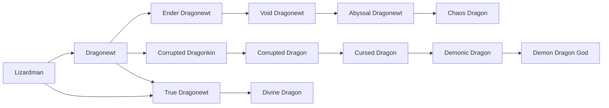
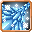

# Ender Dragonewt

<small>[Ascension](../index.md) &rsaquo; [Races](index.md)</small>

| | |
|---|---|
| **ID** | `ascension:ender_dragonewt` |
| **Difficulty** | Hard |
| **Alignment** | Majin |
| **Aura** | 6,000 - 6,000 |
| **Magicule** | 4,000 - 4,000 |
| **Health bonus** | 34 |
| **Spiritual health bonus** | 150 |
| **Attack damage bonus** | 1 |
| **Movement speed bonus** | 0.03 |

> A Dragonewt forever altered by the End — scales drink darkness, eyes burn ender flame.

## Evolution

- **Evolves from:** [Dragonewt](../../tensura-reincarnated/races/dragonewt.md)
- **Evolves into:** [Void Dragonewt](void-dragonewt.md)
- **Default evolution:** [Void Dragonewt](void-dragonewt.md)
- **On awakening (True Demon Lord / True Hero):** [Void Dragonewt](void-dragonewt.md)
- **During the Harvest Festival:** [Void Dragonewt](void-dragonewt.md)

### Requirements to evolve into Ender Dragonewt

Each requirement adds its weight to the evolution progress bar; you can evolve at 100%.

| Requirement | Weight |
|---|---|
| Reach Existence Points of 200,000 | 50% |
| Master [Space Transform](../../tensura-reincarnated/abilities/intrinsic-skills/space-transform.md) | 25% |
| Be in the End | 25% |

### Evolution tree

## Intrinsic skills

Granted automatically when you become this race.

-  [Space Transform](../../tensura-reincarnated/abilities/intrinsic-skills/space-transform.md)
-  [Dragon Eye](../../tensura-reincarnated/abilities/intrinsic-skills/dragon-eye.md)
-  [Dragon Ear](../../tensura-reincarnated/abilities/intrinsic-skills/dragon-ear.md)
-  [Flame Breath](../../tensura-reincarnated/abilities/intrinsic-skills/flame-breath.md)
-  [Ice Breath](../../tensura-reincarnated/abilities/intrinsic-skills/ice-breath.md)
-  [Thunder Breath](../../tensura-reincarnated/abilities/intrinsic-skills/thunder-breath.md)
-  [Magic Resistance](../../tensura-reincarnated/abilities/resistance-skills/magic-resistance.md)
-  [Scale Armor](../../tensura-reincarnated/abilities/intrinsic-skills/scale-armor.md)

## Learnable skills

This race can learn these skills through training.

-  [Spatial Manipulation](../../tensura-reincarnated/abilities/extra-skills/spatial-manipulation.md)
-  [Spatial Motion](../../tensura-reincarnated/abilities/extra-skills/spatial-motion.md)
-  [Spatial Domination](../../tensura-reincarnated/abilities/extra-skills/spatial-domination.md)
-  [Magic Space Transform](../../tensura-reincarnated/abilities/extra-skills/magic-space-transform.md)
-  [Spatial Attack Resistance](../../tensura-reincarnated/abilities/resistance-skills/spatial-attack-resistance.md)

## Attribute modifiers

| Attribute | Amount | Operation |
|---|---|---|
| Jump Strength | 1 | add |
| Scale | size | add |
| Max Health | max HP | add |
| Max Spiritual Health | max spiritual HP | add |
| Attack Damage | attack | add |
| Attack Speed | attack speed | add |
| Knockback Resistance | knockback resistance | add |
| Movement Speed | movement speed | add |
| Swim Speed Multiplier | swim speed | add |

## Stats (config defaults)

Set in [`config/tensura/race/lizardman_config.toml`](../../tensura-reincarnated/configs/config-tensura-race-lizardman-config.md).

| Option | Default | Description |
|---|---|---|
| `Dragonewt.essenceRequirement` | 10 | The number of Dragon Essence consumed to evolve into Dragonewt. |
| `Dragonewt.minAura` | 6,000 | Minimal aura. |
| `Dragonewt.maxAura` | 6,000 | Maximum aura. |
| `Dragonewt.minMagicule` | 4,000 | Minimal magicule. |
| `Dragonewt.maxMagicule` | 4,000 | Maximum magicule. |
| `Dragonewt.size` | 0 | Bonus Size. |
| `Dragonewt.maxHealth` | 34 | Bonus Max Health. |
| `Dragonewt.maxSpiritualHealth` | 150 | Bonus Max Spiritual Health. |
| `Dragonewt.attack` | 1 | Bonus Attack Damage. |
| `Dragonewt.attackSpeed` | 0.3 | Bonus Attack Speed. |
| `Dragonewt.knockbackResistance` | 0.2 | Bonus Knockback Resistance. |
| `Dragonewt.movementSpeed` | 0.03 | Bonus Movement Speed. |
| `Dragonewt.swimSpeed` | 0.3 | Bonus Swimming Speed Multiplier. |
| `Dragonewt.flightBoost` | 0.1 | Flight Boost Power. |
| `Dragonewt.flightCooldown` | 3 | Flight Boost Cooldown. |
| `Lizardman.minAura` | 600 | Minimal aura. |
| `Lizardman.maxAura` | 800 | Maximum aura. |
| `Lizardman.minMagicule` | 100 | Minimal magicule. |
| `Lizardman.maxMagicule` | 200 | Maximum magicule. |
| `Lizardman.size` | 0 | Bonus Size. |
| `Lizardman.maxHealth` | 4 | Bonus Max Health. |
| `Lizardman.maxSpiritualHealth` | 8 | Bonus Max Spiritual Health. |
| `Lizardman.attack` | 0.5 | Bonus Attack Damage. |
| `Lizardman.attackSpeed` | 0.1 | Bonus Attack Speed. |
| `Lizardman.knockbackResistance` | 0 | Bonus Knockback Resistance. |
| `Lizardman.movementSpeed` | 0.01 | Bonus Movement Speed. |
| `Lizardman.swimSpeed` | 0.1 | Bonus Swimming Speed Multiplier. |
