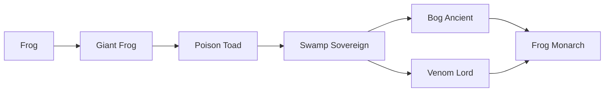

# Frog

<small>[Ascension](../index.md) &rsaquo; [Races](index.md)</small>

| | |
|---|---|
| **ID** | `ascension:frog` |
| **Difficulty** | Easy |
| **Alignment** | Default |
| **Aura** | 300 - 300 |
| **Magicule** | 700 - 700 |
| **Health bonus** | -8 |
| **Spiritual health bonus** | -16 |
| **Attack damage bonus** | -0.5 |
| **Movement speed bonus** | -0.02 |

> A small amphibian with a knack for water and poison. The first step.

## Evolution

- **Evolves into:** [Giant Frog](giant-frog.md)
- **Default evolution:** [Giant Frog](giant-frog.md)
- **On awakening (True Demon Lord / True Hero):** [Giant Frog](giant-frog.md)
- **During the Harvest Festival:** [Giant Frog](giant-frog.md)

### Evolution tree

## Intrinsic skills

Granted automatically when you become this race.

-  [Water Breathing](../../tensura-reincarnated/abilities/intrinsic-skills/water-breathing.md)

## Learnable skills

This race can learn these skills through training.

-  [Poison Resistance](../../tensura-reincarnated/abilities/resistance-skills/poison-resistance.md)
-  [Water Current Control](../../tensura-reincarnated/abilities/common-skills/water-current-control.md)
-  [Toxic Skin](../abilities/extra-skills/toxic-skin.md)

## Attribute modifiers

| Attribute | Amount | Operation |
|---|---|---|
| Scale | -0.3 | add |
| Scale | size | add |
| Max Health | max HP | add |
| Max Spiritual Health | max spiritual HP | add |
| Attack Damage | attack | add |
| Attack Speed | attack speed | add |
| Knockback Resistance | knockback resistance | add |
| Movement Speed | movement speed | add |
| Swim Speed Multiplier | swim speed | add |

## Stats (config defaults)

Set in [`config/tensura/race/goblin_config.toml`](../../tensura-reincarnated/configs/config-tensura-race-goblin-config.md).

| Option | Default | Description |
|---|---|---|
| `Goblin.minAura` | 300 | Minimal aura. |
| `Goblin.maxAura` | 300 | Maximum aura. |
| `Goblin.minMagicule` | 700 | Minimal magicule. |
| `Goblin.maxMagicule` | 700 | Maximum magicule. |
| `Goblin.size` | -0.25 | Bonus Size. |
| `Goblin.maxHealth` | -8 | Bonus Max Health. |
| `Goblin.maxSpiritualHealth` | -16 | Bonus Max Spiritual Health. |
| `Goblin.attack` | -0.5 | Bonus Attack Damage. |
| `Goblin.attackSpeed` | -0.5 | Bonus Attack Speed. |
| `Goblin.knockbackResistance` | 0 | Bonus Knockback Resistance. |
| `Goblin.movementSpeed` | -0.02 | Bonus Movement Speed. |
| `Goblin.swimSpeed` | -0.2 | Bonus Swimming Speed Multiplier. |
