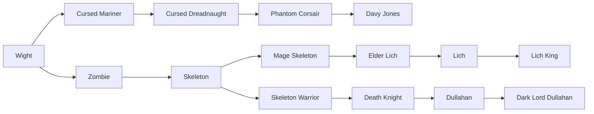
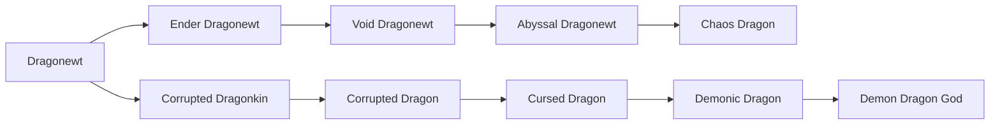
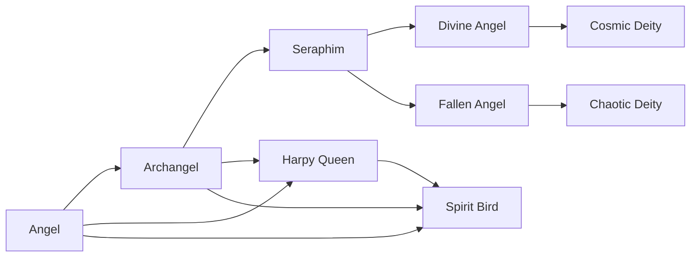
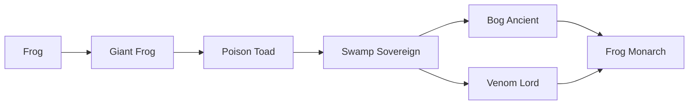

# Races

<small>[Ascension](../index.md)</small>

Ascension adds **69** races: **7** starting, **49** in-between and **13** final.

- **Starting:** the first race of its evolution line. Nothing evolves into it, so you get it by reincarnating into it or through a special item, skill or event.
- **In-between:** reached by evolving, and can evolve further.
- **Final:** the last step of its line. It does not evolve any further.

Races that link to other mods' races (for example an addon race that evolves from a Tensura race) are placed using the whole pack's evolution trees.

| Race | Stage | Difficulty | Alignment | Evolves from | Evolves into |
|---|---|---|---|---|---|
| [3 Tailed Fox](three-tail-fox.md) | In-between | Intermediate | Default | [Kitsune](kitsune.md) | [6 Tailed Fox](six-tail-fox.md) |
| [6 Tailed Fox](six-tail-fox.md) | In-between | Hard | Default | [3 Tailed Fox](three-tail-fox.md) | [9 Tailed Fox](nine-tail-fox.md) |
| [9 Tailed Fox](nine-tail-fox.md) | In-between | Extreme | Default | [6 Tailed Fox](six-tail-fox.md) | [Divine Kitsune](divine-kitsune.md) |
| [Abyssal Dragonewt](abyssal-dragonewt.md) | In-between | Extreme | Majin | [Void Dragonewt](void-dragonewt.md) | [Chaos Dragon](chaos-dragon.md) |
| [Angel](angel.md) | Starting | Hard | Holy |  | [Archangel](archangel.md), [Spirit Bird](../../tensura-reincarnated/races/spirit-bird.md), [Harpy Queen](../../tensura-reincarnated/races/harpy-queen.md) |
| [Archangel](archangel.md) | In-between | Hard | Holy | [Angel](angel.md) | [Seraphim](seraphim.md), [Spirit Bird](../../tensura-reincarnated/races/spirit-bird.md), [Harpy Queen](../../tensura-reincarnated/races/harpy-queen.md) |
| [Ascended Djinn](ascended-djinn.md) | In-between | Extreme | Holy | [Primordial Djinn](primordial-djinn.md) | [Sovereign Djinn](sovereign-djinn.md) |
| [Beholder](beholder.md) | In-between | Extreme | Majin | [Gauth](gauth.md) | [Death Tyrant](death-tyrant.md) |
| [Blood Noble](blood-noble.md) | In-between | Intermediate | Default | [Kindred Bloodfiend](kindred-bloodfiend.md) | [Elder Bloodfiend](elder-bloodfiend.md) |
| [Bog Ancient](bog-ancient.md) | In-between | Hard | Default | [Swamp Sovereign](swamp-sovereign.md) | [Frog Monarch](frog-monarch.md) |
| [Chaos Dragon](chaos-dragon.md) | Final | Extreme | Majin | [Abyssal Dragonewt](abyssal-dragonewt.md) |  |
| [Chaotic Deity](chaotic-deity.md) | Final | Extreme | Majin | [Fallen Angel](fallen-angel.md) |  |
| [Corrupted Dragon](corrupted-dragon.md) | In-between | Hard | Majin | [Corrupted Dragonkin](corrupted-dragonkin.md) | [Cursed Dragon](cursed-dragon.md) |
| [Corrupted Dragonkin](corrupted-dragonkin.md) | In-between | Hard | Majin | [Dragonewt](../../tensura-reincarnated/races/dragonewt.md) | [Corrupted Dragon](corrupted-dragon.md) |
| [Cosmic Deity](cosmic-deity.md) | Final | Extreme | Holy | [Divine Angel](divine-angel.md) |  |
| [Cursed Dragon](cursed-dragon.md) | In-between | Extreme | Majin | [Corrupted Dragon](corrupted-dragon.md) | [Demonic Dragon](demonic-dragon.md) |
| [Cursed Dreadnaught](cursed-dreadnaught.md) | In-between | Hard | Majin | [Cursed Mariner](cursed-mariner.md) | [Phantom Corsair](phantom-corsair.md) |
| [Cursed Mariner](cursed-mariner.md) | In-between | Hard | Majin | [Wight](../../tensura-reincarnated/races/wight.md) | [Cursed Dreadnaught](cursed-dreadnaught.md) |
| [Dark Lord Dullahan](dark-lord-dullahan.md) | Final | Extreme | Majin | [Dullahan](dullahan.md) |  |
| [Davy Jones](davy-jones.md) | Final | Extreme | Majin | [Phantom Corsair](phantom-corsair.md) |  |
| [Death Knight](death-knight.md) | In-between | Hard | Majin | [Skeleton Warrior](skeleton-warrior.md) | [Dullahan](dullahan.md) |
| [Death Tyrant](death-tyrant.md) | Final | Extreme | Majin | [Beholder](beholder.md) |  |
| [Demon Dragon God](demon-dragon-god.md) | Final | Extreme | Majin | [Demonic Dragon](demonic-dragon.md) |  |
| [Demonic Dragon](demonic-dragon.md) | In-between | Extreme | Majin | [Cursed Dragon](cursed-dragon.md) | [Demon Dragon God](demon-dragon-god.md) |
| [Divine Angel](divine-angel.md) | In-between | Extreme | Holy | [Seraphim](seraphim.md) | [Cosmic Deity](cosmic-deity.md) |
| [Divine King](divine-king.md) | In-between | Hard | Holy | [Monkey King](monkey-king.md) | [Sun Wukong](sun-wukong.md) |
| [Divine Kitsune](divine-kitsune.md) | Final | Extreme | Default | [9 Tailed Fox](nine-tail-fox.md) |  |
| [Dullahan](dullahan.md) | In-between | Hard | Majin | [Death Knight](death-knight.md) | [Dark Lord Dullahan](dark-lord-dullahan.md) |
| [Elder Bloodfiend](elder-bloodfiend.md) | In-between | Hard | Default | [Blood Noble](blood-noble.md) | [Progenitor Bloodfiend](progenitor-bloodfiend.md) |
| [Elder Lich](elder-lich.md) | In-between | Hard | Majin | [Mage Skeleton](mage-skeleton.md) | [Lich](lich.md) |
| [Ender Dragonewt](ender-dragonewt.md) | In-between | Hard | Majin | [Dragonewt](../../tensura-reincarnated/races/dragonewt.md) | [Void Dragonewt](void-dragonewt.md) |
| [Fallen Angel](fallen-angel.md) | In-between | Extreme | Majin | [Seraphim](seraphim.md) | [Chaotic Deity](chaotic-deity.md) |
| [Fledgling Bloodfiend](fledgling-bloodfiend.md) | Starting | Easy | Default |  | [Kindred Bloodfiend](kindred-bloodfiend.md) |
| [Frog](frog.md) | Starting | Easy | Default |  | [Giant Frog](giant-frog.md) |
| [Frog Monarch](frog-monarch.md) | Final | Extreme | Default | [Bog Ancient](bog-ancient.md), [Venom Lord](venom-lord.md) |  |
| [Gauth](gauth.md) | In-between | Extreme | Majin | [Mindwitness](mindwitness.md) | [Beholder](beholder.md) |
| [Gazer](gazer.md) | Starting | Hard | Majin |  | [Spectator](spectator-gazer.md) |
| [Giant Frog](giant-frog.md) | In-between | Easy | Default | [Frog](frog.md) | [Poison Toad](poison-toad.md) |
| [Infinite Djinn](infinite-djinn.md) | In-between | Extreme | Holy | [Sovereign Djinn](sovereign-djinn.md) | [Omniversal Djinn](omniversal-djinn.md) |
| [Kindred Bloodfiend](kindred-bloodfiend.md) | In-between | Easy | Default | [Fledgling Bloodfiend](fledgling-bloodfiend.md) | [Blood Noble](blood-noble.md) |
| [Kitsune](kitsune.md) | Starting | Intermediate | Default |  | [3 Tailed Fox](three-tail-fox.md) |
| [Lich](lich.md) | In-between | Hard | Majin | [Elder Lich](elder-lich.md) | [Lich King](lich-king.md) |
| [Lich King](lich-king.md) | Final | Extreme | Majin | [Lich](lich.md) |  |
| [Mage Skeleton](mage-skeleton.md) | In-between | Intermediate | Majin | [Skeleton](undead-skeleton.md) | [Elder Lich](elder-lich.md) |
| [Mindwitness](mindwitness.md) | In-between | Hard | Majin | [Spectator](spectator-gazer.md) | [Gauth](gauth.md) |
| [Monkey](monkey.md) | Starting | Easy | Default |  | [Monkey Warrior](monkey-warrior.md) |
| [Monkey King](monkey-king.md) | In-between | Intermediate | Default | [Monkey Martial Artist](monkey-martial-artist.md) | [Divine King](divine-king.md) |
| [Monkey Martial Artist](monkey-martial-artist.md) | In-between | Intermediate | Default | [Monkey Warrior](monkey-warrior.md) | [Monkey King](monkey-king.md) |
| [Monkey Warrior](monkey-warrior.md) | In-between | Easy | Default | [Monkey](monkey.md) | [Monkey Martial Artist](monkey-martial-artist.md) |
| [Omniversal Djinn](omniversal-djinn.md) | Final | Extreme | Holy | [Infinite Djinn](infinite-djinn.md) |  |
| [Phantom Corsair](phantom-corsair.md) | In-between | Hard | Majin | [Cursed Dreadnaught](cursed-dreadnaught.md) | [Davy Jones](davy-jones.md) |
| [Phantom Djinn](phantom-djinn.md) | In-between | Intermediate | Default | [Trickster Djinn](trickster-djinn.md) | [Royal Djinn](royal-djinn.md) |
| [Poison Toad](poison-toad.md) | In-between | Intermediate | Default | [Giant Frog](giant-frog.md) | [Swamp Sovereign](swamp-sovereign.md) |
| [Primordial Djinn](primordial-djinn.md) | In-between | Hard | Holy | [Wishbound Djinn](wishbound-djinn.md) | [Ascended Djinn](ascended-djinn.md) |
| [Progenitor Bloodfiend](progenitor-bloodfiend.md) | Final | Extreme | Default | [Elder Bloodfiend](elder-bloodfiend.md) |  |
| [Royal Djinn](royal-djinn.md) | In-between | Intermediate | Holy | [Phantom Djinn](phantom-djinn.md) | [Wishbound Djinn](wishbound-djinn.md) |
| [Seraphim](seraphim.md) | In-between | Extreme | Holy | [Archangel](archangel.md) | [Divine Angel](divine-angel.md), [Fallen Angel](fallen-angel.md) |
| [Skeleton](undead-skeleton.md) | In-between | Intermediate | Majin | [Zombie](zombie.md) | [Skeleton Warrior](skeleton-warrior.md), [Mage Skeleton](mage-skeleton.md) |
| [Skeleton Warrior](skeleton-warrior.md) | In-between | Intermediate | Majin | [Skeleton](undead-skeleton.md) | [Death Knight](death-knight.md) |
| [Sovereign Djinn](sovereign-djinn.md) | In-between | Extreme | Holy | [Ascended Djinn](ascended-djinn.md) | [Infinite Djinn](infinite-djinn.md) |
| [Spectator](spectator-gazer.md) | In-between | Hard | Majin | [Gazer](gazer.md) | [Mindwitness](mindwitness.md) |
| [Sun Wukong](sun-wukong.md) | Final | Extreme | Holy | [Divine King](divine-king.md) |  |
| [Swamp Sovereign](swamp-sovereign.md) | In-between | Intermediate | Default | [Poison Toad](poison-toad.md) | [Bog Ancient](bog-ancient.md), [Venom Lord](venom-lord.md) |
| [Trickster Djinn](trickster-djinn.md) | In-between | Easy | Default | [Whisper Djinn](whisper-djinn.md) | [Phantom Djinn](phantom-djinn.md) |
| [Venom Lord](venom-lord.md) | In-between | Hard | Default | [Swamp Sovereign](swamp-sovereign.md) | [Frog Monarch](frog-monarch.md) |
| [Void Dragonewt](void-dragonewt.md) | In-between | Hard | Majin | [Ender Dragonewt](ender-dragonewt.md) | [Abyssal Dragonewt](abyssal-dragonewt.md) |
| [Whisper Djinn](whisper-djinn.md) | Starting | Easy | Default |  | [Trickster Djinn](trickster-djinn.md) |
| [Wishbound Djinn](wishbound-djinn.md) | In-between | Hard | Holy | [Royal Djinn](royal-djinn.md) | [Primordial Djinn](primordial-djinn.md) |
| [Zombie](zombie.md) | In-between | Easy | Majin | [Wight](../../tensura-reincarnated/races/wight.md) | [Skeleton](undead-skeleton.md) |

## Evolution trees

### Wight line

### Whisper Djinn line

### Abyssal Dragonewt line

### Angel line

### Frog line

### Gazer line

### Monkey line

### Kitsune line

### Fledgling Bloodfiend line

