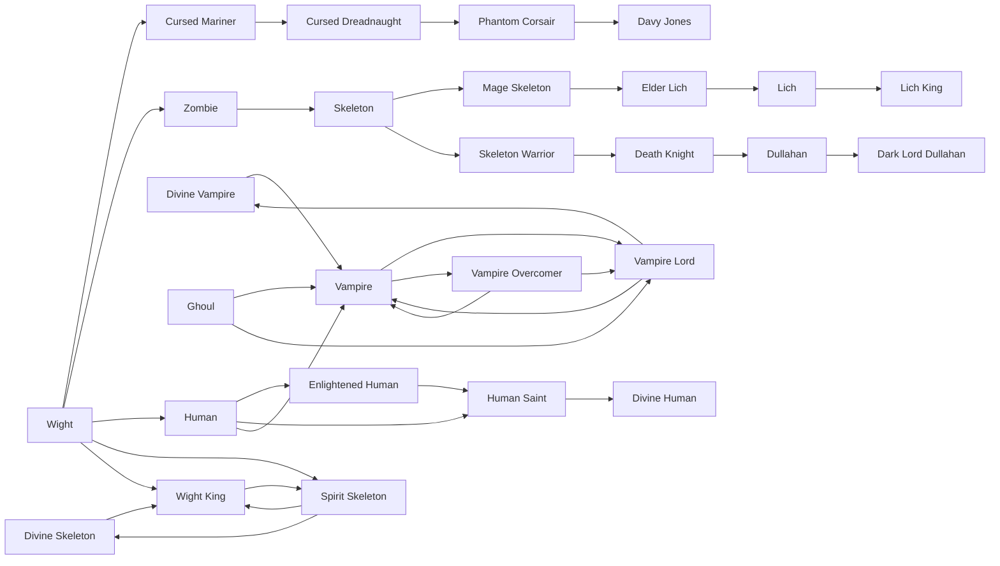
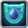

# Phantom Corsair

<small>[Ascension](../index.md) &rsaquo; [Races](index.md)</small>

| | |
|---|---|
| **ID** | `ascension:phantom_corsair` |
| **Difficulty** | Hard |
| **Alignment** | Majin |
| **Aura** | 100 - 500 |
| **Magicule** | 2,000 - 3,000 |
| **Health bonus** | 0 |
| **Spiritual health bonus** | 0 |
| **Attack damage bonus** | 0 |
| **Movement speed bonus** | 0 |

> A dread pirate dissolved into spectral darkness — slips through walls and commands the deep.

## Evolution

- **Evolves from:** [Cursed Dreadnaught](cursed-dreadnaught.md)
- **Evolves into:** [Davy Jones](davy-jones.md)
- **Default evolution:** [Davy Jones](davy-jones.md)
- **On awakening (True Demon Lord / True Hero):** [Davy Jones](davy-jones.md)
- **During the Harvest Festival:** [Davy Jones](davy-jones.md)

### Requirements to evolve into Phantom Corsair

Each requirement adds its weight to the evolution progress bar; you can evolve at 100%.

| Requirement | Weight |
|---|---|
| Reach Existence Points of phantom_corsair (evolution ep) | 50% |
| True Demon Lord | 50% |

### Evolution tree

## Intrinsic skills

Granted automatically when you become this race.

-  [Body Armor](../../tensura-reincarnated/abilities/intrinsic-skills/body-armor.md)
-  [Water Breathing](../../tensura-reincarnated/abilities/intrinsic-skills/water-breathing.md)
-  [Drain](../../tensura-reincarnated/abilities/intrinsic-skills/drain.md)
-  [Physical Attack Resistance](../../tensura-reincarnated/abilities/resistance-skills/physical-attack-resistance.md)
-  [Pain Nullification](../../tensura-reincarnated/abilities/resistance-skills/pain-nullification.md)

## Learnable skills

This race can learn these skills through training.

-  [Water Manipulation](../../tensura-reincarnated/abilities/extra-skills/water-manipulation.md)
-  [Spatial Motion](../../tensura-reincarnated/abilities/extra-skills/spatial-motion.md)
-  [Magic Darkness Transform](../../tensura-reincarnated/abilities/extra-skills/magic-darkness-transform.md)
-  [Darkness Attack Resistance](../../tensura-reincarnated/abilities/resistance-skills/darkness-attack-resistance.md)
-  [Water Attack Nullification](../../tensura-reincarnated/abilities/resistance-skills/water-attack-nullification.md)
-  [Body Double](../../tensura-reincarnated/abilities/extra-skills/body-double.md)
-  [Weather Domination](../../tensura-reincarnated/abilities/extra-skills/weather-domination.md)
-  [Spiritual Attack Resistance](../../tensura-reincarnated/abilities/resistance-skills/spiritual-attack-resistance.md)
-  [Water Current Control](../../tensura-reincarnated/abilities/common-skills/water-current-control.md)
-  [Mortal Fear](../../tensura-reincarnated/abilities/extra-skills/mortal-fear.md)
-  [Steel Strength](../../tensura-reincarnated/abilities/extra-skills/steel-strength.md)
-  [Water Attack Resistance](../../tensura-reincarnated/abilities/resistance-skills/water-attack-resistance.md)
-  [Cold Resistance](../../tensura-reincarnated/abilities/resistance-skills/cold-resistance.md)

## Traits

- Damage handling for fire

## Attribute modifiers

| Attribute | Amount | Operation |
|---|---|---|
| Scale | 0.27 | add |
| Scale | 0.13 | add |
| Scale | 0 | add |
| Max Health | 0 | add |
| Max Spiritual Health | 0 | add |
| Attack Damage | 0 | add |
| Attack Speed | -0.2 | add |
| Knockback Resistance | 0 | add |
| Movement Speed | 0 | add |
| Swim Speed Multiplier | 0 | add |

## Stats (config defaults)

Set in [`config/tensura/race/wight_config.toml`](../../tensura-reincarnated/configs/config-tensura-race-wight-config.md).

| Option | Default | Description |
|---|---|---|
| `Wight.minAura` | 100 | Minimal aura. |
| `Wight.maxAura` | 500 | Maximum aura. |
| `Wight.minMagicule` | 2,000 | Minimal magicule. |
| `Wight.maxMagicule` | 3,000 | Maximum magicule. |
| `Wight.size` | 0 | Bonus Size. |
| `Wight.maxHealth` | 0 | Bonus Max Health. |
| `Wight.maxSpiritualHealth` | 0 | Bonus Max Spiritual Health. |
| `Wight.attack` | 0 | Bonus Attack Damage. |
| `Wight.attackSpeed` | -0.2 | Bonus Attack Speed. |
| `Wight.knockbackResistance` | 0 | Bonus Knockback Resistance. |
| `Wight.movementSpeed` | 0 | Bonus Movement Speed. |
| `Wight.swimSpeed` | 0 | Bonus Swimming Speed Multiplier. |
