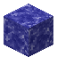

# Blue Marble Wall

<small>[Corail Tombstone](../index.md) &rsaquo; [Blocks](index.md)</small>

| | |
|---|---|
| **ID** | `tombstone:blue_marble_wall` |
| **Tool** | Pickaxe |

## What it does

Decorative wall made from [Blue Marble](blue-marble.md).

## Drops

| Item | Count | Chance | Notes |
|---|---|---|---|
|  [Blue Marble Wall](blue-marble-wall.md) | 1 | 100% |  |

## Obtaining

### Recipes

**Crafting (shaped)** &rarr;  [Blue Marble Wall](blue-marble-wall.md) x6

| | | |
|---|---|---|
|  [Blue Marble](blue-marble.md) |  [Blue Marble](blue-marble.md) |  [Blue Marble](blue-marble.md) |
|  [Blue Marble](blue-marble.md) |  [Blue Marble](blue-marble.md) |  [Blue Marble](blue-marble.md) |

**Stonecutter** &rarr;  [Blue Marble Wall](blue-marble-wall.md)

Ingredients:  [Blue Marble](blue-marble.md)

### Loot

| Source | Count | Chance | Notes |
|---|---|---|---|
| Breaking [Blue Marble Wall](blue-marble-wall.md) | 1 | 100% |  |

## Tags

`minecraft:mineable/pickaxe`, `minecraft:soul_speed_blocks`, `minecraft:walls`
