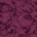
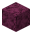

# Carmin Marble Stairs

<small>[Corail Tombstone](../index.md) &rsaquo; [Blocks](index.md)</small>

| | |
|---|---|
| **ID** | `tombstone:carmin_marble_stairs` |
| **Tool** | Pickaxe |

## What it does

Decorative stairs made from [Carmin Marble](carmin-marble.md).

## Drops

| Item | Count | Chance | Notes |
|---|---|---|---|
|  [Carmin Marble Stairs](carmin-marble-stairs.md) | 1 | 100% |  |

## Obtaining

### Recipes

**Crafting (shaped)** &rarr;  [Carmin Marble Stairs](carmin-marble-stairs.md) x4

| | | |
|---|---|---|
|  [Carmin Marble](carmin-marble.md) |   |   |
|  [Carmin Marble](carmin-marble.md) |  [Carmin Marble](carmin-marble.md) |   |
|  [Carmin Marble](carmin-marble.md) |  [Carmin Marble](carmin-marble.md) |  [Carmin Marble](carmin-marble.md) |

**Stonecutter** &rarr;  [Carmin Marble Stairs](carmin-marble-stairs.md)

Ingredients:  [Carmin Marble](carmin-marble.md)

### Loot

| Source | Count | Chance | Notes |
|---|---|---|---|
| Breaking [Carmin Marble Stairs](carmin-marble-stairs.md) | 1 | 100% |  |

## Tags

`minecraft:mineable/pickaxe`, `minecraft:soul_speed_blocks`, `minecraft:stairs`
