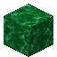

# Green Marble

<small>[Corail Tombstone](../index.md) &rsaquo; [Blocks](index.md)</small>

| | |
|---|---|
| **ID** | `tombstone:green_marble` |

## Drops

| Item | Count | Chance | Notes |
|---|---|---|---|
|  [Green Marble](green-marble.md) | 1 | 100% |  |

## Obtaining

### Recipes

**Crafting (shapeless)** &rarr;  [Green Marble](green-marble.md)

Ingredients:  [Grave Dust](../items/materials/grave-dust.md),  [Stone](https://minecraft.wiki/w/Stone),  [Emerald](https://minecraft.wiki/w/Emerald)

### Loot

| Source | Count | Chance | Notes |
|---|---|---|---|
| Breaking [Green Marble](green-marble.md) | 1 | 100% |  |

## Used in

Decorative Grave Cross, Decorative Grave Normal, Decorative Grave Original, Decorative Grave Simple, [Green Marble Slab](green-marble-slab.md), [Green Marble Stairs](green-marble-stairs.md), [Green Marble Wall](green-marble-wall.md), Decorative Subaraki Grave, Decorative Tombstone, [Strange Tablet](../items/miscellaneous/strange-tablet.md)

## Tags

`tombstone:grave_marbles`
