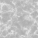

# Blocks

<small>[Corail Tombstone](../index.md)</small>

Corail Tombstone adds **22** blocks.

| | Name | ID |
|---|---|---|
|  | [Abandoned Grave](abandoned-grave.md) | `tombstone:abandoned_grave` |
|  | [Blue Marble](blue-marble.md) | `tombstone:blue_marble` |
|  | [Blue Marble Slab](blue-marble-slab.md) | `tombstone:blue_marble_slab` |
|  | [Blue Marble Stairs](blue-marble-stairs.md) | `tombstone:blue_marble_stairs` |
|  | [Blue Marble Wall](blue-marble-wall.md) | `tombstone:blue_marble_wall` |
|  | [Carmin Marble](carmin-marble.md) | `tombstone:carmin_marble` |
|  | [Carmin Marble Slab](carmin-marble-slab.md) | `tombstone:carmin_marble_slab` |
|  | [Carmin Marble Stairs](carmin-marble-stairs.md) | `tombstone:carmin_marble_stairs` |
|  | [Carmin Marble Wall](carmin-marble-wall.md) | `tombstone:carmin_marble_wall` |
|  | [Dark Marble](dark-marble.md) | `tombstone:dark_marble` |
|  | [Dark Marble Slab](dark-marble-slab.md) | `tombstone:dark_marble_slab` |
|  | [Dark Marble Stairs](dark-marble-stairs.md) | `tombstone:dark_marble_stairs` |
|  | [Dark Marble Wall](dark-marble-wall.md) | `tombstone:dark_marble_wall` |
|  | [Green Marble](green-marble.md) | `tombstone:green_marble` |
|  | [Green Marble Slab](green-marble-slab.md) | `tombstone:green_marble_slab` |
|  | [Green Marble Stairs](green-marble-stairs.md) | `tombstone:green_marble_stairs` |
|  | [Green Marble Wall](green-marble-wall.md) | `tombstone:green_marble_wall` |
|  | [Thorn Veil](thornveil.md) | `tombstone:thornveil` |
|  | [White Marble](white-marble.md) | `tombstone:white_marble` |
|  | [White Marble Slab](white-marble-slab.md) | `tombstone:white_marble_slab` |
|  | [White Marble Stairs](white-marble-stairs.md) | `tombstone:white_marble_stairs` |
|  | [White Marble Wall](white-marble-wall.md) | `tombstone:white_marble_wall` |
