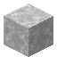

# White Marble Slab

<small>[Corail Tombstone](../index.md) &rsaquo; [Blocks](index.md)</small>

| | |
|---|---|
| **ID** | `tombstone:white_marble_slab` |
| **Tool** | Pickaxe |

## What it does

Decorative slab made from [White Marble](white-marble.md).

## Drops

| Item | Count | Chance | Notes |
|---|---|---|---|
|  [White Marble Slab](white-marble-slab.md) | 1 | 100% |  |

## Obtaining

### Recipes

**Crafting (shapeless)** &rarr;  [White Marble Slab](white-marble-slab.md) x2

Ingredients:  [White Marble](white-marble.md)

**Stonecutter** &rarr;  [White Marble Slab](white-marble-slab.md) x2

Ingredients:  [White Marble](white-marble.md)

### Loot

| Source | Count | Chance | Notes |
|---|---|---|---|
| Breaking [White Marble Slab](white-marble-slab.md) | 1 | 100% |  |

## Tags

`minecraft:mineable/pickaxe`, `minecraft:slabs`, `minecraft:soul_speed_blocks`
