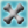

# Bone Shield

<small>[Corail Tombstone](../index.md) &rsaquo; [Effects](index.md)</small>

| | |
|---|---|
| **ID** | `tombstone:bone_shield` |

> Protects against melee damages and reflects a part
