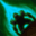
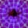

# Effects

<small>[Corail Tombstone](../index.md)</small>

Status effects added by Corail Tombstone.

| | Effect | Type | Description |
|---|---|---|---|
|  | [Aquatic Life](aquatic-life.md) |  | Allows to move freely and breathe in the water |
|  | [Bait](bait.md) |  | Attracts aggressive creatures |
|  | [Bone Shield](bone-shield.md) |  | Protects against melee damages and reflects a part |
|  | [Decrepitude](decrepitude.md) |  | Reduces health by a percentage over time |
|  | [Discretion](discretion.md) |  | Improves stealth speed and reduces range detection |
|  | [Diversion](diversion.md) |  | Prevents creatures to target you |
|  | [Earthly Garden](earthly-garden.md) |  | Makes the surroundings more flowery |
|  | [Feather Fall](feather-fall.md) |  | Slows down your falls |
|  | [Frost Resistance](frost-resistance.md) |  | Reduces damage taken by frost by 75% |
|  | [Frostbite](frostbite.md) |  | Freezes and damages enemy |
|  | [Ghostly Shape](ghostly-shape.md) |  | Ghostly appearance received after a death |
|  | [Giant Strength](giant-strength.md) |  | Your strength increases as well as your height |
|  | [Incurable](incurable.md) |  | The heals have no effect |
|  | [Lightning Resistance](lightning-resistance.md) |  | Reduces damage taken by lightning by 75% |
|  | [Little World](little-world.md) |  | Your height decreases and makes you faster |
|  | [Mercy](mercy.md) |  | Share beneficial effects among nearby allies |
|  | [Prayer](prayer.md) |  | Received when a prayer is cast on the target |
|  | [Preservation](preservation.md) |  | Preserves experience and beneficial effects on death |
|  | [Projectile Reflection](projectile-reflection.md) |  | Reflects the projectiles to their owner |
|  | [Purification](purification.md) |  | Dispels negative effects over time |
|  | [Reach](reach.md) |  | Increases the range to hit creatures or to harvest |
|  | [Remanence](remanence.md) |  | Increases experience gains |
|  | [Restoration](restoration.md) |  | Heal all wounds |
|  | [Silent Bond](silent-bond.md) |  | The undead consider you as one of their own |
|  | [True Sight](true-sight.md) |  | Lets you see in the dark, in the fog and underwater |
|  | [Unstable Intangibility](unstable-intangibility.md) |  | Prevents damage for a full second every five seconds |
|  | [Weaver's Walk](weaver-walk.md) |  | Allows you to move quickly over cobwebs |
