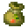
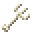
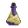
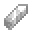
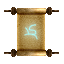
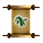
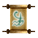
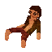

# Miscellaneous

<small>[Corail Tombstone](../../index.md) &rsaquo; [Items](../index.md)</small>

| | Name | Description |
|---|---|---|
|  | [Ankh of Prayer](ankh-of-prayer.md) | Allows you to pray for your soul on graves |
|  | [Bag of Seeds](bag-of-seeds.md) | Seeds are present inside |
|  | [Bone Needle](bone-needle.md) | Create a bind with a kind of creature to be used in magic practices |
|  | [Bone Scepter](bone-scepter.md) | Allows you to force your undead minions to remain seated |
|  | [Book of Disenchantment](book-of-disenchantment.md) | Can strip some enchantments from an item and return them as books |
|  | [Book of Magic Impregnation](book-of-magic-impregnation.md) | Strengthens with magic an item |
|  | [Book of Oblivion](book-of-oblivion.md) | Resets your Perks |
|  | [Book of Recycling](book-of-recycling.md) | Can recycle an item to obtain its crafting ingredients |
|  | [Book of Repairing](book-of-repairing.md) | Can magically repair an item |
|  | [Book of Scribe](book-of-scribe.md) | Can magically create multiple copies of a magic scroll |
|  | [Book of Soulbound](book-of-soulbound.md) | Enchants an item with Soulbound |
|  | [Christmas Gift](christmas-gift.md) | This gift has appeared mysteriously and doesn't seem to want to open. A message is written there: "Cannot be opened... |
|  | [Dust of Frost](dust-of-frost.md) | An easy retreat. |
|  | [Dust of Vanishing](dust-of-vanishing.md) | Allows for an easy retreat |
|  | [Essence of Undeath](essence-of-undeath.md) | A crafting ingredient for decorative graves. |
|  | [Fishing Rod of Misadventure](fishing-rod-of-misadventure.md) | Presages unlucky fishing |
|  | [Flying Carpet](flying-carpet.md) | The carpet can carry you through the air or underwater in the direction of your gaze |
|  | [Gemstone of Familiar](gemstone-of-familiar.md) | Theses rare magic gemstones allow to bring back to life your last dead familiar |
|  | [Gemstone of Guardian](gemstone-of-guardian.md) | Theses rare magic gemstones allow to invoke a Grave Guardian |
|  | [Gemstone of Merchant](gemstone-of-merchant.md) | Theses rare magic gemstones allow to obtain better exchanges with a merchant |
|  | [Gemstone of Prayer](gemstone-of-prayer.md) | Theses rare magic gemstones allow to reset your Ankh ability |
|  | [Grave Key](grave-key.md) | Allows you to see your grave at a distance |
|  | [Impregnated Diamond](impregnated-diamond.md) | A crafting ingredient for the receptacle of familiar. |
|  | [Lost Tablet](lost-tablet.md) | This tablet must have possessed a great power long ago |
|  | [Magic Lollipop](lollipop.md) | The effects are unpredictable |
|  | [Memorial Plaque](grave-plate.md) | Memorial Plaque. |
|  | [Receptacle of Familiar](receptacle-of-familiar.md) | This receptacle allows to capture the soul of one of your dead familiars |
|  | [Receptacle of Soul](receptacle-of-soul.md) | A soul is trapped in this magical container |
|  | [Reward](gift.md) | Reward received by completing advancements in Corail Tombstone |
|  | [Ritual Flute](ritual-flute.md) | The Watchers did not always need words: their flutes guided the rituals where only memory could sing |
|  | [Scroll of Aquatic Life](scroll-of-aquatic-life.md) |  |
|  | [Scroll of Feather Falling](scroll-of-feather-fall.md) |  |
|  | [Scroll of Frost Resistance](scroll-of-frost-resistance.md) |  |
|  | [Scroll of Knowledge](scroll-of-knowledge.md) | Lost Scroll of Erdos |
|  | [Scroll of Lightning Resistance](scroll-of-lightning-resistance.md) |  |
|  | [Scroll of Mercy](scroll-of-mercy.md) |  |
|  | [Scroll of Preservation](scroll-of-preservation.md) |  |
|  | [Scroll of Projectile Reflection](scroll-of-projectile-reflection.md) |  |
|  | [Scroll of Purification](scroll-of-purification.md) |  |
|  | [Scroll of Reach](scroll-of-reach.md) |  |
|  | [Scroll of True Sight](scroll-of-true-sight.md) |  |
|  | [Scroll of Unstable Intangibility](scroll-of-unstable-intangibility.md) |  |
|  | [Seeker Rod](seeker-rod.md) | A slightly special rod guiding you to places holding secret knowledges |
|  | [Smoke Ball](smoke-ball.md) | Has no use except producing smoke |
|  | [Strange Christmas Hat](christmas-hat.md) | A strange hat that brings good luck and slightly increase your running speed |
|  | [Strange Tablet](strange-tablet.md) | A blank tablet for making Magic Tablets by combining it in your inventory: Gunpowder makes a Tablet of Assistance, a... |
|  | [Tablet of Assistance](tablet-of-assistance.md) | Allows you to teleport to another player |
|  | [Tablet of Cupidity](tablet-of-cupidity.md) | Can bring you fortune, even if few have returned |
|  | [Tablet of Guard](tablet-of-guard.md) | Invoke a spectral wolf to protect the place for a short time |
|  | [Tablet of Home](tablet-of-home.md) | Allows you to teleport to your respawn point |
|  | [Tablet of Recall](tablet-of-recall.md) | Allows you to teleport to a memorized location |
|  | [Villager Gift](villager-gift.md) | This gift will not be delivered on time if no one takes care of bringing it near the villager's bed |
|  | [Voodoo Poppet](voodoo-poppet.md) | Prevents your next death |
