# Blocks

<small>[Elite Tensura](../index.md)</small>

Elite Tensura adds **130** blocks.

| | Name | ID |
|---|---|---|
|  | [Albis Plushie](plushie-albis.md) | `elitetensura:plushie_albis` |
|  | [Allay Plushie](plushie-allay.md) | `elitetensura:plushie_allay` |
|  | [Alvis Plushie](plushie-alvis.md) | `elitetensura:plushie_alvis` |
| 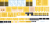 | [Apito Plushie](plushie-apito.md) | `elitetensura:plushie_apito` |
|  | [Arena Anchor](arena-anchor.md) | `elitetensura:arena_anchor` |
|  | [Armadillo Plushie](plushie-armadillo.md) | `elitetensura:plushie_armadillo` |
|  | [Axolotl Plushie](plushie-axolotl.md) | `elitetensura:plushie_axolotl` |
|  | [Basic Forge Station](forge-station-basic.md) | `elitetensura:forge_station_basic` |
|  | [Bat Plushie](plushie-bat.md) | `elitetensura:plushie_bat` |
|  | [Bee Plushie](plushie-bee.md) | `elitetensura:plushie_bee` |
|  | [Benimaru Plushie](plushie-benimaru.md) | `elitetensura:plushie_benimaru` |
|  | [Beretta Plushie](plushie-beretta.md) | `elitetensura:plushie_beretta` |
|  | [Blaze Plushie](plushie-blaze.md) | `elitetensura:plushie_blaze` |
|  | [Breeze Plushie](plushie-breeze.md) | `elitetensura:plushie_breeze` |
|  | [Camel Plushie](plushie-camel.md) | `elitetensura:plushie_camel` |
|  | [Carrera Plushie](plushie-carrera.md) | `elitetensura:plushie_carrera` |
|  | [Cat Plushie](plushie-cat.md) | `elitetensura:plushie_cat` |
|  | [Cave Spider Plushie](plushie-cave-spider.md) | `elitetensura:plushie_cave_spider` |
|  | [Chewie Plushie](plushie-chewie.md) | `elitetensura:plushie_chewie` |
|  | [Chicken Plushie](plushie-chicken.md) | `elitetensura:plushie_chicken` |
|  | [Common Crate](common-crate.md) | `elitetensura:common_crate` |
|  | [Cow Plushie](plushie-cow.md) | `elitetensura:plushie_cow` |
|  | [Creeper Plushie](plushie-creeper.md) | `elitetensura:plushie_creeper` |
|  | [Dan Rolo Plushie](plushie-dan-rolo.md) | `elitetensura:plushie_dan_rolo` |
|  | [Darth Vader Plushie](plushie-dark-father.md) | `elitetensura:plushie_dark_father` |
|  | [Diablo Plushie](plushie-diablo.md) | `elitetensura:plushie_diablo` |
|  | [Dolphin Plushie](plushie-dolphin.md) | `elitetensura:plushie_dolphin` |
|  | [Donkey Plushie](plushie-donkey.md) | `elitetensura:plushie_donkey` |
|  | [Dragonforge Station](forge-station-dragonforge.md) | `elitetensura:forge_station_dragonforge` |
|  | [Drowned Plushie](plushie-drowned.md) | `elitetensura:plushie_drowned` |
|  | [Elder Guardian Plushie](plushie-elder-guardian.md) | `elitetensura:plushie_elder_guardian` |
|  | [Elite Crate](elite-crate.md) | `elitetensura:elite_crate` |
|  | [Emperor Plushie](plushie-emperor.md) | `elitetensura:plushie_emperor` |
|  | [Enderdragon Plushie](plushie-enderdragon.md) | `elitetensura:plushie_enderdragon` |
|  | [Enderman Plushie](plushie-enderman.md) | `elitetensura:plushie_enderman` |
|  | [Eren Plushie](plushie-eren.md) | `elitetensura:plushie_eren` |
|  | [Evoker Plushie](plushie-evoker.md) | `elitetensura:plushie_evoker` |
|  | [Fox Plushie](plushie-fox.md) | `elitetensura:plushie_fox` |
|  | [Frog Plushie](plushie-frog.md) | `elitetensura:plushie_frog` |
|  | [Gabiru Plushie](plushie-gabiru.md) | `elitetensura:plushie_gabiru` |
|  | [Gazel Plushie](plushie-gazel.md) | `elitetensura:plushie_gazel` |
| 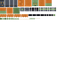 | [Geld Plushie](plushie-geld.md) | `elitetensura:plushie_geld` |
|  | [Ghast Plushie](plushie-ghast.md) | `elitetensura:plushie_ghast` |
|  | [Glow Squid Plushie](plushie-glow-squid.md) | `elitetensura:plushie_glow_squid` |
|  | [Goat Plushie](plushie-goat.md) | `elitetensura:plushie_goat` |
|  | [Gobta Plushie](plushie-gobta.md) | `elitetensura:plushie_gobta` |
|  | [Grucius Plushie](plushie-grucius.md) | `elitetensura:plushie_grucius` |
|  | [Guardian Plushie](plushie-guardian.md) | `elitetensura:plushie_guardian` |
|  | [Guy Crimson Plushie](plushie-guy-crimson.md) | `elitetensura:plushie_guy_crimson` |
|  | [Hakurou Plushie](plushie-hakurou.md) | `elitetensura:plushie_hakurou` |
| 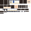 | [Hinata Plushie](plushie-hinata.md) | `elitetensura:plushie_hinata` |
| 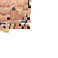 | [Hoglin Plushie](plushie-hoglin.md) | `elitetensura:plushie_hoglin` |
|  | [Horse Plushie](plushie-horse.md) | `elitetensura:plushie_horse` |
|  | [Husk Plushie](plushie-husk.md) | `elitetensura:plushie_husk` |
|  | [Iron Golem Plushie](plushie-iron-golem.md) | `elitetensura:plushie_iron_golem` |
|  | [Kumara Plushie](plushie-kumara.md) | `elitetensura:plushie_kumara` |
|  | [Kurobe Plushie](plushie-kurobe.md) | `elitetensura:plushie_kurobe` |
|  | [Large Magic Bud](magic-ore-large-bud.md) | `elitetensura:magic_ore_large_bud` |
|  | [Leon Plushie](plushie-leon.md) | `elitetensura:plushie_leon` |
|  | [Ley Nexus](ley-nexus.md) | `elitetensura:ley_nexus` |
| 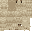 | [Llama Plushie](plushie-llama.md) | `elitetensura:plushie_llama` |
|  | [Luminous Plushie](plushie-luminous.md) | `elitetensura:plushie_luminous` |
|  | [Magic Cluster](magic-ore-cluster.md) | `elitetensura:magic_ore_cluster` |
|  | [Magic Ore Mother Rock](magic-ore-mother-rock.md) | `elitetensura:magic_ore_mother_rock` |
|  | [Magisteel Forge Station](forge-station-magisteel.md) | `elitetensura:forge_station_magisteel` |
|  | [Magma Cube Plushie](plushie-magma-cube.md) | `elitetensura:plushie_magma_cube` |
|  | [Medium Magic Bud](magic-ore-medium-bud.md) | `elitetensura:magic_ore_medium_bud` |
|  | [Milim Plushie](plushie-milim.md) | `elitetensura:plushie_milim` |
|  | [Mithril Forge Station](forge-station-mythril.md) | `elitetensura:forge_station_mythril` |
|  | [Mooshroom Plushie](plushie-mooshroom.md) | `elitetensura:plushie_mooshroom` |
| 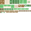 | [Moss Plushie](plushie-moss.md) | `elitetensura:plushie_moss` |
| 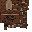 | [Mule Plushie](plushie-mule.md) | `elitetensura:plushie_mule` |
|  | [Nation Core](nation-core.md) | `elitetensura:nation_core` |
|  | [Panda Plushie](plushie-panda.md) | `elitetensura:plushie_panda` |
|  | [Parrot Plushie](plushie-parrot.md) | `elitetensura:plushie_parrot` |
|  | [Peter Plushie](plushie-peter.md) | `elitetensura:plushie_peter` |
|  | [Phantom Plushie](plushie-phantom.md) | `elitetensura:plushie_phantom` |
|  | [Pig Plushie](plushie-pig.md) | `elitetensura:plushie_pig` |
|  | [Piglin Brute Plushie](plushie-piglin-brute.md) | `elitetensura:plushie_piglin_brute` |
|  | [Piglin Plushie](plushie-piglin.md) | `elitetensura:plushie_piglin` |
|  | [Pillager Plushie](plushie-pillager.md) | `elitetensura:plushie_pillager` |
|  | [Polar Bear Plushie](plushie-polar-bear.md) | `elitetensura:plushie_polar_bear` |
|  | [Pufferfish Plushie](plushie-pufferfish.md) | `elitetensura:plushie_pufferfish` |
|  | [Rabbit Plushie](plushie-rabbit.md) | `elitetensura:plushie_rabbit` |
|  | [Ramiris Plushie](plushie-ramiris.md) | `elitetensura:plushie_ramiris` |
|  | [Ranga Plushie](plushie-ranga.md) | `elitetensura:plushie_ranga` |
|  | [Rare Crate](rare-crate.md) | `elitetensura:rare_crate` |
|  | [Ravanger Plushie](plushie-ravanger.md) | `elitetensura:plushie_ravanger` |
|  | [Rimuru Plushie](plushie-rimuru.md) | `elitetensura:plushie_rimuru` |
|  | [Rimuru Slime Plushie](plushie-rimuru-slime.md) | `elitetensura:plushie_rimuru_slime` |
|  | [Sheep Plushie](plushie-sheep.md) | `elitetensura:plushie_sheep` |
| 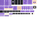 | [Shion Plushie](plushie-shion.md) | `elitetensura:plushie_shion` |
|  | [Shulker Plushie](plushie-shulker.md) | `elitetensura:plushie_shulker` |
|  | [Shuna Plushie](plushie-shuna.md) | `elitetensura:plushie_shuna` |
|  | [Skeleton Horse Plushie](plushie-skeleton-horse.md) | `elitetensura:plushie_skeleton_horse` |
| 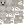 | [Skeleton Plushie](plushie-skeleton.md) | `elitetensura:plushie_skeleton` |
|  | [Slime Plushie](plushie-slime.md) | `elitetensura:plushie_slime` |
|  | [Small Magic Bud](magic-ore-small-bud.md) | `elitetensura:magic_ore_small_bud` |
|  | [Sniffer Plushie](plushie-sniffer.md) | `elitetensura:plushie_sniffer` |
|  | [Souei Plushie](plushie-souei.md) | `elitetensura:plushie_souei` |
|  | [Spider Plushie](plushie-spider.md) | `elitetensura:plushie_spider` |
|  | [Squid Plushie](plushie-squid.md) | `elitetensura:plushie_squid` |
|  | [Starfall Ore](starfall-ore.md) | `elitetensura:starfall_ore` |
| 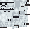 | [Storm Soldier Plushie](plushie-storm-soldier.md) | `elitetensura:plushie_storm_soldier` |
|  | [Stray Plushie](plushie-stray.md) | `elitetensura:plushie_stray` |
|  | [Strider Plushie](plushie-strider.md) | `elitetensura:plushie_strider` |
|  | [Suphia Plushie](plushie-suphia.md) | `elitetensura:plushie_suphia` |
|  | [Testarossa Plushie](plushie-testarossa.md) | `elitetensura:plushie_testarossa` |
|  | [Trader Lama Plushie](plushie-trader-lama.md) | `elitetensura:plushie_trader_lama` |
|  | [Treyni Plushie](plushie-treyni.md) | `elitetensura:plushie_treyni` |
|  | [Turtle Plushie](plushie-turtle.md) | `elitetensura:plushie_turtle` |
|  | [Ultima Plushie](plushie-ultima.md) | `elitetensura:plushie_ultima` |
|  | [Veldora (Human Form) Plushie](plushie-veldora-human.md) | `elitetensura:plushie_veldora_human` |
|  | [Veldora Plushie](plushie-veldora.md) | `elitetensura:plushie_veldora` |
|  | [Velzard Plushie](plushie-velzard.md) | `elitetensura:plushie_velzard` |
| 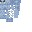 | [Vex Plushie](plushie-vex.md) | `elitetensura:plushie_vex` |
| 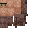 | [Villager Plushie](plushie-villager.md) | `elitetensura:plushie_villager` |
|  | [Vindicator Plushie](plushie-vindicator.md) | `elitetensura:plushie_vindicator` |
|  | [Wandering Trader Plushie](plushie-wandering-trader.md) | `elitetensura:plushie_wandering_trader` |
|  | [Warden Plushie](plushie-warden.md) | `elitetensura:plushie_warden` |
|  | [Witch Plushie](plushie-witch.md) | `elitetensura:plushie_witch` |
|  | [Wither Plushie](plushie-wither.md) | `elitetensura:plushie_wither` |
|  | [Wither Skeleton Plushie](plushie-wither-skeleton.md) | `elitetensura:plushie_wither_skeleton` |
|  | [Wolf Plushie](plushie-wolf.md) | `elitetensura:plushie_wolf` |
|  | [Yoda Plushie](plushie-yoga.md) | `elitetensura:plushie_yoga` |
|  | [Zegion Plushie](plushie-zegion.md) | `elitetensura:plushie_zegion` |
|  | [Zoglin Plushie](plushie-zoglin.md) | `elitetensura:plushie_zoglin` |
|  | [Zombie Plushie](plushie-zombie.md) | `elitetensura:plushie_zombie` |
|  | [Zombie Villager Plushie](plushie-zombie-villager.md) | `elitetensura:plushie_zombie_villager` |
|  | [Zombified Piglin Plushie](plushie-zombified-piglin.md) | `elitetensura:plushie_zombified_piglin` |
