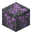

# Magic Ore Mother Rock

<small>[Elite Tensura](../index.md) &rsaquo; [Blocks](index.md)</small>

| | |
|---|---|
| **ID** | `elitetensura:magic_ore_mother_rock` |
| **Tool** | Pickaxe |
| **Tool tier** | Stone |

## What it does

A crystal-growing rock. In magic-rich chunks, Magic Ore slowly turns into Mother Rock, and Mother Rock sprouts **Magic Ore crystal buds** on its open sides that grow Small → Medium → Large → Cluster. Each step uses up some of the chunk's magicule (300, 575, 850 and 1,000). All of this only happens when the `ETMagiculeWorldSystem` gamerule is on (it's off by default).

Ore block. You need a stone pickaxe or better.

## Drops

| Item | Count | Chance | Notes |
|---|---|---|---|
|  [Magic Ore Mother Rock](magic-ore-mother-rock.md) | 1 | 100% |  |

## Obtaining

### Loot

| Source | Count | Chance | Notes |
|---|---|---|---|
| Breaking [Magic Ore Mother Rock](magic-ore-mother-rock.md) | 1 | 100% |  |

## Tags

`c:ores`, `minecraft:mineable/pickaxe`, `minecraft:needs_stone_tool`
