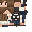

# Dan Rolo Plushie

<small>[Elite Tensura](../index.md) &rsaquo; [Blocks](index.md)</small>

| | |
|---|---|
| **ID** | `elitetensura:plushie_dan_rolo` |

## What it does

A collectible plushie. Place it as decoration (it has no collision) or wear it on your head. Plushies can't be crafted: they come from **crates** and from winning **chat trivia**. Each trivia win after your second gives a random plushie from your highest unlocked tier: Uncommon from 8 lifetime wins, Rare from 16, Epic from 25 and Legendary from 30.

## Drops

| Item | Count | Chance | Notes |
|---|---|---|---|
|  [Dan Rolo Plushie](plushie-dan-rolo.md) | 1 | 100% |  |

## Obtaining

### Loot

| Source | Count | Chance | Notes |
|---|---|---|---|
| Breaking [Dan Rolo Plushie](plushie-dan-rolo.md) | 1 | 100% |  |

## Tags

`elitetensura:elitetensura`
