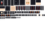

# Diablo Plushie

<small>[Elite Tensura](../index.md) &rsaquo; [Blocks](index.md)</small>

| | |
|---|---|
| **ID** | `elitetensura:plushie_diablo` |

## Drops

| Item | Count | Chance | Notes |
|---|---|---|---|
|  [Diablo Plushie](plushie-diablo.md) | 1 | 100% |  |

## Obtaining

### Loot

| Source | Count | Chance | Notes |
|---|---|---|---|
| Breaking [Diablo Plushie](plushie-diablo.md) | 1 | 100% |  |

## Tags

`elitetensura:elitetensura`
