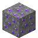
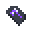

# Starfall Ore

<small>[Elite Tensura](../index.md) &rsaquo; [Blocks](index.md)</small>

| | |
|---|---|
| **ID** | `elitetensura:starfall_ore` |
| **Tool** | Pickaxe |
| **Tool tier** | Diamond |

## What it does

Ore block. Mining it drops [Star Iron](../items/miscellaneous/star-iron.md). You need a diamond pickaxe or better.

## Drops

| Item | Count | Chance | Notes |
|---|---|---|---|
|  [Starfall Ore](starfall-ore.md) | 1 | 50% | Needs a specific tool |
|  [Star Iron](../items/miscellaneous/star-iron.md) | 1 | 50% |  |

## Obtaining

### Loot

| Source | Count | Chance | Notes |
|---|---|---|---|
| Breaking [Starfall Ore](starfall-ore.md) | 1 | 50% | Needs a specific tool |

## Tags

`minecraft:mineable/pickaxe`, `minecraft:needs_diamond_tool`
