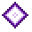
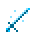
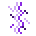

# Effects

<small>[Elite Tensura](../index.md)</small>

Status effects added by Elite Tensura.

| | Effect | Type | Description |
|---|---|---|---|
|  | [Bound](bound.md) | Harmful | Bound in Hephaestus's chains. |
|  | [Celestial Mark](celestial-mark.md) | Neutral | A mark left by the astral edge. |
|  | [Cycle Debt](cycle-debt.md) | Harmful | The price of an Ouroboros rebirth. |
|  | [Cycle's End](cycle-armed.md) | Beneficial | Ouroboros's rebirth is ready. |
|  | [Dimensional Mark](dimensional-mark.md) | Neutral | A mark left by the void edge. |
|  | [Eternal Renewal](eternal-renewal.md) | Beneficial | Shows that Ouroboros is toggled on. |
|  | [Fenrir Effect](fenrir-sword-effect.md) | Harmful | Frostbite from the fenrir sword. |
|  | [Fractured Reality](fractured-reality.md) | Harmful | Reality cracking around you, from the void edge's fracture ability. |
|  | [Kaioken](kaioken.md) | Beneficial | Kaioken, a transformation with four tiers (the tier you can reach depends on your EP: ,  and  for tiers II to IV). |
|  | [Rend](rend.md) | Harmful | Torn armor. |
|  | [Starlight Judgment](starlight-judgment.md) | Harmful | Judged by starlight, from the astral edge's dawn ability. |
