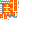

# Elite Key

<small>[Elite Tensura](../../index.md) &rsaquo; [Items](../index.md) &rsaquo; [Miscellaneous](index.md)</small>

| | |
|---|---|
| **ID** | `elitetensura:elite_key` |
| **Category** | Miscellaneous |
| **Stack size** | 64 |

