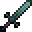

# Nations

<small>[Elite Tensura](../../index.md) &rsaquo; [Elite Tensura Codex](index.md)</small>

Build, ally, and war with FTB-team nations.

##  Alliances &amp; War

Nations shape the world through diplomacy - **alliances** and **wars**.
  
**Alliances** are pacts between nations. Allies may join your wars.

How many you can hold depends on your Reputation tier - from **5** at Exalted down to **none** while rogue. Forming one grants both nations reputation; **breaking** one costs the breaker dearly.

**Declaring War**

There is **no accept step**. Your Sovereign declares, and the war begins: */etnation war declare &lt;player&gt;*.
  
Declaring costs treasury cash, **+25%** for every level you are above your target.

You are blocked if you are rogue, at your war cap, allied to them, or they are under **loser grace** from a recent defeat.
  
Declaring on a much weaker nation is **bullying** - allowed, but it costs reputation.

**The Campaign**

A war is a race for **war score**, not a fight to the death.

- **Warmup** - 24h, no scoring. Allies may join
- **Active** - 72h, scoring live
- **Resolution** - spoils and standing
- **Cooldown** - 2h before you may clash again

The loser also gets **24h of grace** where nobody may declare on them.
  
Follow it with */etnation war status*.

**Scoring**

- Enemy kill - **10** points
- Kill inside their claims - **doubled**
- Repeat kill on one victim - decays to a quarter
- **Regicide** (their Sovereign) - 50
- **First Blood** - 15
- **Rampage** (3 victims) - 30

- A Masterwork+ forge craft while the war runs - scales with quality
  
*Raiding pays double. Farming one player does not pay at all. Crafters contribute without fighting.*
  
Objectives rotate every 4 hours for both sides.

**Bounties**

Your Sovereign may escrow treasury cash on an enemy's head: */etnation war bounty &lt;player&gt; &lt;amount&gt;* - minimum **$1000**.

Any killer on your side takes the **whole escrow** into their bank, plus 20 points for the side. Re-placing tops it up; unclaimed cash refunds when the war ends.
  
*These are separate from the public bounty board.*

**Victory &amp; Spoils**

At the deadline the **higher score wins**. A tie is a draw with no spoils. A side may also */etnation war surrender* once the war is active (not during warmup).
  
The victor loots a share of the loser's **treasury** - paid to the winning nation itself, not its allies.

Winning grants reputation, with a bonus if you were the **defender**. Losing or surrendering costs it.
  
*Treasury withdrawals are locked during a war - build your war chest before you declare.*

**On the Map**

While a war of yours is warming up or active, the enemy's claimed land turns **war-red** on the FTB Chunks map - the large map, the minimap and the claim screen all show it.
  
Your own and every ally's **Nation Core** is pinned too; the enemy's is pinned as well until the war ends.

Hover a Core pin for the nation's name, its tier, and whether it's shattered. A nation hiding its claims never tints - its land just reads as unclaimed.
  
You can turn these map markers off for yourself in the mod's config, and your server can disable the whole overlay too.

**Ley Nexus**

While a war is **Active**, **1-3 Ley Nexus** crystals rise on unclaimed ground between the two nations. Stand within **16 blocks** to fill its capture meter for your side - majority presence wins it, ties freeze it, and about **60s** of unopposed control captures or flips it.

Holding a Nexus pays your nation **2 war points** every minute a holder of yours stands inside it - an empty site holds control but pays nothing.
  
Sites show on your war panel and the FTB map, and the Voice of the World announces when one appears or changes hands. They vanish when the war ends.

**Peace Terms**

Win a war outright and your Sovereign has **24h** to set lasting peace terms on the loser, from the Codex Diplomacy tab or */etnation war terms &lt;pact\|tribute\|vassal&gt;*. How lopsided the win was caps what you can pick.

- **Pact** - always available; neither side may declare on the other
- **Tribute** - needs a **1.25x** score win; pact plus a daily cut of the loser's income

- **Vassalage** - needs **2x**; tribute plus the vassal can't declare war, auto-joins its liege's wars, and the liege auto-joins wars declared on it
  
A surrender always counts as a rout, opening every tier.

Leave it unpicked and the loser gets an automatic pact.
  
Terms run **7 days**. Tribute is **10%** of the loser's hourly income x24 (minimum $200/day) - skipped, never taken on debt, if they can't pay.

A liege may free their vassal early: */etnation war release &lt;nation&gt;*. */etnation war terms* alone shows your nation's current terms. Active terms also show on Discord's !nation.

## Contracts &amp; Bounties

The **contract board** is server-wide. Nations post jobs; anyone can take them.
  
Open it with */etcontract gui*.
  
Two kinds of posting share the board:
- **Delivery contracts** - bring us N of an item
- **Bounties** - kill this player

*It is the main way nations deal with players who are not their citizens.*

**Deliveries**

A nation asks for an item and count, backed by treasury cash, an escrowed item stack, or both.
  
**Anyone may fulfil one** - including players with no nation at all.

Matching is by **item type and count only**. Durability, enchantments and custom names are ignored, so a worn enchanted pickaxe satisfies a request for one pickaxe. *Post accordingly.*

**Bounties**

A nation posts on a named **online** player. Whoever kills them first is paid **automatically** - no claim step.
  
Four rules keep them honest:
- The killer must **not** be in the posting nation - checked at the kill
- Nor may the target

- **One open bounty per target** - the same nation may top it up, another nation must wait
- The kill must be a **direct player kill** - void, fall, lava and mobs pay nothing
  
*Members of a nation currently at war with the poster cannot fulfil its contracts.*

**Posting**

You must be in a founded nation and hold a high enough rank.
  
From the board, the header shows **+ Contract** and **+ Bounty** buttons. They open a form where you pick the requirement and reward straight from your inventory grid.

*Nothing moves when you click - the form uses ghost slots, so closing it can never lose or duplicate an item.*
  
Commands still work: */etcontract post\|postbounty\|list\|cancel\|fulfil*.

**Refunds**

Contracts expire on a timer. Cancelled, expired and disbanded-nation postings all refund the same way: **cash to the treasury, items to whoever posted them**.
  
Nations have a cap on open contracts, and some servers block posting during a war.

*A war bounty and a board bounty can sit on the same victim at once - a qualifying kill pays both.*

**Posting on Your Own**

You do not need a nation to use the board. **Any player** may post a delivery or a bounty, funded from their own bank and inventory instead of a treasury - the board marks these rows *(player)* instead of a nation name.

Personal posts ignore nation war locks, and you may have up to **3** open at once. Several players may each place a bounty on the same target - every row stacks, and a kill pays out **every bounty the killer qualifies for** at once (never their own, never their nation's).

Personal bounty cash always pays **1:1**, and any refund returns straight to your bank.
  
*Nation members who outrank a Citizen see a Treasury / My bank toggle on the posting forms; everyone else always posts personally.*

##  Founding a Nation

A **Nation** is your FTB team raised into a power on the world stage. The team owner rules as **Sovereign**; the rest become citizens.
  
Nations gain levels, claim land, earn achievements, build reputation, forge alliances, and wage war.

Off by default - a server enables it with the **ETNationSystem** gamerule.

**Founding a Nation**

First form an FTB party and claim a little land. Then, as the team owner, run **/etnation found**.
  
You need at least **2 members** *AND* **1 claimed chunk**.

The nation starts at Level 1. Its alignment is taken from you: Demon Lord -&gt; Demonic, True Hero -&gt; Heroic, otherwise Neutral.

**Roles &amp; Commands**

Ranks come straight from your FTB team:
- **Sovereign** - the ruler (found, disband, capital)
- **Officer** - may set the capital
- **Citizen** - a member
  
Use **/etnation**:
- *info* / *gui* - view your nation
- *score* - level &amp; score breakdown

- *setcapital*, *list*, *disband*

**Growing Stronger**

A nation's **level** (max 20) is driven by a score that rewards almost everything you do together:
- Members &amp; claimed territory
- Total member EP
- Awakened members, True Heroes, Demon Lords
- Records earned &amp; world events joined
- Nation achievements

The score updates on its own - check it with */etnation score*.

**Rewards &amp; Glory**

Each level grants more **claim chunks** (about 4 per level), so growing literally widens your borders.

**Achievements** unlock nation-wide bonuses for members, and the first nation to reach certain feats seizes a **World Record** announced to everyone - Largest Territory, Most Citizens, Most Demon Lords, Mightiest Nation.

**Your Story**

Every founded nation keeps its own **History** - a ledger of what shaped it: founding, level-ups, members joining and leaving, wars won and lost, alliances made and broken, wonders raised, the Core rising or falling, achievements earned.

Read it in the Codex Nation tab under **History**, newest first. Up to **100** lines are kept; the oldest fade past that. Names are written down as they were, so a rival that later disbanded still reads right. The ledger ends with the nation.

**Doctrines**

From **level 3** a nation may adopt one **doctrine** - a permanent stance with a strength and a weakness. The first choice is free. Changing it later costs **$1,000,000** from the treasury and locks you in for **14 days**.

- **Militarist** - +25% war kill points, but +25% upkeep
- **Mercantile** - +50% treasury interest and +15% territory income, but -25% war kill points
- **Arcane** - the Core's aura is 1.5x stronger, but your spawner mob cap drops 25%
- **Builder** - wonder stages cost 20% less cash, but territory income drops 20%

Each doctrine also tilts your **missions**: objectives that suit it roll twice as often.
  
Fall into **debt** and the strength switches off while the weakness stays - climb out to get it back.

The Sovereign chooses with */etnation doctrine* - a card with a clickable row per doctrine - or from the **Doctrine** block at the top of the Codex Perks section. Your current doctrine also shows on the Nation overview.

**Going Further**

Three deeper systems build on your nation - each has its own page:
- **Reputation** - your standing, and the diplomacy it gates
- **Alliances &amp; War** - pacts and conflicts
- **Nation Spawners** - level-gated mob spawners

## Going It Alone

Not every player wants to found or join a nation - so nations are not the only door to their rewards.
  
While you belong to **no founded nation**, you get your own perks, your own missions, and titles that reward the road alone.

Join or found a nation later and these simply switch off - nothing is lost, they just stand aside.

**Personal Perks**

Buy timed perks straight from your own bank in the Nation screen's Perks section, or */etnation perks buy &lt;id&gt;*:
- *Forge Focus* - wider hammer sweet spots
- *Keen Senses* - +5% magicule &amp; aura gain from kills
- *Wanderer's Stride* - +5% movement speed

- *Hardy* - +2 max health
- *Frugal Hands* - cheaper magicule-flow forge stages
  
Each lasts a **week**; buying again renews it.

**Personal Missions**

You draw **2** missions of your own each cycle - the same cycle nations draw theirs from - covering hunting, forge crafts, EP growth, unlocking titles, and travel.

Clearing one pays cash straight to your bank and a crate key; clearing every mission in the cycle pays a better key on top.
  
Check them in the Nation screen's Missions tab, or */etnation missions*.

**The Lone Wolf Line**

Three titles reward staying nationless and moving: **Lone Wolf** -&gt; **Wandering Sovereign** -&gt; **Unbound**, each deeper and rarer than the last.
  
Lone Wolf asks for **7** days spent nationless while online and **5,000** blocks travelled - the days need not be consecutive.

*Joining or founding a nation resets your nationless-day count, so the line is truly for players who stay unaligned.*

**Home Ground**

You do not need a nation to claim land, and territory bonuses that key off **your own claims** still work for you.

*Gaia*'s strength on your own soil, for one, honours a personal claim exactly as it would a nation's - you do not need to found or join anything to fight on home ground.

## Nation Core

The **Nation Core** is a block your nation places to become a real target and a real anchor - distinct from your capital chunk.
  
It watches over your land with a standing **aura**, and it can be **besieged** by an enemy nation at war with you.

Only a Sovereign or Officer may raise one, and a nation may only ever have one.

**Raising a Core**

Forge one at a **Dragonforge** station from **8 Hihiirokane Ingots**, **8 Adamantite Ingots**, **16 Magic Stone** and **2 Earth Cores**.
  
Place it inside your nation's own claimed land. Only a Sovereign or Officer may place it, and only where no core already stands.

Sneak and right-click your core with empty hands for a **status card** - tier, health and the next tier's price, with clickable **Upgrade** and (Sovereign only) **Take down** links. Neither works while a war is warming up or active.

**The Aura**

Standing near an intact core, inside your own nation's claims, grants every member a standing bonus to **magicule/aura regeneration** and **armor**.
  
The aura reaches out several chunks around the core.

It falls silent if your treasury goes into **debt** - restoring the moment you climb back out.

**Tiers**

A core starts at **Tier 1** and can be raised to **Tier 4** from the treasury - **$500,000**, **$1,500,000** and **$3,000,000** by default. Each tier grows its siege health (**5,000** up to **16,000**), its aura reach (**8** up to **14** chunks) and the aura's regeneration and armor.

Buy from the status card, with */etnation core upgrade*, or with the **Upgrade Core** button in the Codex. The block shows its tier: an inner ring at 2, an outer ring at 3, orbiting shards at 4.
  
A higher tier is also a bigger prize - toppling it hands the attacker more war score.

**Siege**

A nation you are actively at war with may attack your core - **warmup does not count**, only once the war turns active.
  
A boss bar appears while the core is under attack, with warnings as it crosses **75%**, **50%** and **25%** health remaining.

If it falls, the attacker gains extra war score and a slice of your treasury moves to them once the war resolves - your core stands **shattered** until repaired, and **loses one tier**.

**Repair**

A Sovereign or Officer repairs a damaged or shattered core by right-clicking it while at peace - cost scales with how much health is missing, paid from the treasury.
  
*Without an active treasury, repairs are free.*

A core that falls in war is also mended automatically once the war ends.

## Nation Missions

**Missions** are recurring objectives your whole nation works on together.
  
Every nation rolls at the **same moment**, on a **7-day** cycle, drawing **3** missions filtered to your level.

Open the **Missions** tab of the Nation screen, or use */etnation missions*.
  
*Missions do not need the banking mod - only their cash rewards do.*

**Delta &amp; Absolute**

At the roll, every nation statistic is snapshotted.

- A **delta** mission asks you to *increase* something - claim 20 more chunks
- An **absolute** mission asks you to *reach* a value - have 8 members

A delta mission cannot be completed by standing still, and cannot be cheesed by having already been large.

**Frozen Targets**

Thresholds are calculated from your population **at the roll** and then frozen.
  
Recruiting ten people mid-cycle does not move the goalposts - it makes the existing targets *easier*.
  
Missions **auto-complete**. There is no claim step.

A nation founded mid-cycle sits out until the next roll, starting fresh with everyone else.

**Rewards**

Each mission pays **reputation**, optional **treasury cash**, a **Common Key** to every online member, and **+1** to your missions-completed count.
  
That counter is permanent and feeds your nation's **score** (and so its level).

Clearing **every** mission in a cycle hands every online member a **Rare Key**; a server may also attach a nation-wide buff until the next roll. A cycle never repeats a mission it rolled last time.

##  Nation Spawners

Nation Spawners put your team's **mob spawners** under nation law - stronger nations may run bigger, deadlier spawners.
  
This only affects **player-placed** spawners. Natural, dungeon, and trial spawners are never touched.

Off by default - a server turns it on with the **ETNationSpawnerSystem** gamerule.

**How It Works**

When a nation member places a spawner, it is claimed for that nation.
  
Each time it tries to spawn a mob, two checks run:
- The mob must be **unlocked** at your nation's level
- Your nation must be under its **active-mob cap**

Fail either check and that spawn is skipped - the spawner just tries again next cycle.

**Tier Ladder**

Higher nation levels unlock stronger mobs and raise the cap:
- Lvl **1** - cap 4: common beasts, goblins, slimes
- Lvl **5** - cap 8: creepers, orcs, direwolves
- Lvl **10** - cap 12
- Lvl **15** - cap 16

- Lvl **20** - cap 18: apex beasts (megalodon, arch daemon)
  
The *Spawner Overclock* nation perk counts your nation as one level higher for these checks.

**Good to Know**

Unlocks are **cumulative** - your nation can spawn anything from every tier at or below its level, using the cap of its highest unlocked tier.

The cap counts **living** spawner-mobs across your whole nation. Hit it and spawners pause; thin the herd or break a spawner to free room.
  
*Datapacks can retune the levels, caps, and mob lists.*

## Nation Wonders

A **Wonder** is a multi-stage nation project - build one and every member keeps its bonus for as long as your nation stands.
  
Six exist. Two of them are **server-unique** - only one nation in the world may ever hold them at a time.

Building one needs an active treasury. Open the Wonders section of the Nation screen, or use */etnation wonder*.

**Building One**

Each Wonder has **three stages**, and each stage needs both treasury cash and deposited items before its build timer starts.
- *start &lt;id&gt;* - begin a project (Sovereign/Officer, one at a time)
- *pay* - spend treasury cash on the current stage

- *contribute* - deposit the held stack, or click a slot in the contribute screen
  
Once both the cash and items are in, the stage arms and finishes on its own timer. Only your nation's level gates which Wonders you may start.

**The Six Wonders**

- **Grand Forge** - bonus critical upgrades at the forge
- **Aether Spire** - doubles your Nation Core's aura reach and strength
- **War Academy** - more war kill points for every member
- **Hall of Records** - an extra synergy slot and faster EP growth

- **Sanctum of the World** *(unique)* - faster magicule and aura regeneration for **every player alive**
- **Eternal Beacon** *(unique)* - blunts calamity boss damage for **every player alive**
  
The last two are the server-unique pair - claim one before a rival nation does.

**Cancelling**

Changed your mind mid-build? */etnation wonder cancel* refunds part of the current stage's paid cash.
  
**Deposited items are never returned** - the game warns you before you confirm.

A finished stage is permanent; only the stage still in progress can be cancelled.

##  Reputation

Every nation has a **Reputation** from **-1000** to **+1000**, shown as a tier:
- Reviled, Infamous, Distrusted
- Neutral
- Respected, Honored, Exalted
  
Left alone, reputation slowly *drifts back toward Neutral* over time.

**Gaining &amp; Losing**

Your deeds move the needle:
- Win a war (more on defense) **+**; lose one **-**
- Bully a far weaker nation **-**
- Form an alliance **+**; break one **-**
- Defend a Calamity, attend a Walpurgis, earn achievements **+**
- Hostile council rulings **-**, friendly ones **+**

**What It Gates**

Your standing opens or closes diplomacy:
- **Rogue** - fall to **-250** or below and you are branded a rogue state
- **War** - you must sit above the war floor to declare

- **Alliances** - your tier caps how many you may hold: Neutral 2, Respected 3, Honored 4, Exalted 5 (Distrusted just 1; lower, none)

## Treasury &amp; Upkeep

A nation can hold money. The **treasury** pays for levels, perks, wars and contracts - and it is drained daily by **upkeep**.
  
Open the **Treasury** tab of the Nation screen, or use */etnation treasury*.

*This requires the banking mod and must be enabled by your server. Without it, nations level from score alone.*

**Income**

- **Deposits** - */etnation treasury deposit*
- **Pickup tax** - a slice of every member's cash pickup
- **Territory income** - paid periodically, scaling with claimed chunks and level

The pickup tax splits two ways: **5%** to your treasury and **10%** into the central bank reserve - a server-wide money sink.
  
Territory income never stops, even in debt. That is what makes recovery possible.

**Spending**

**Levels are bought** once the economy runs: */etnation levelup*. You must both qualify by score and pay.
  
**Perks** are bought from the treasury: */etnation perks buy &lt;id&gt;*.

A few are 1-hour buffs (War Footing, Swift Hands, Stone Skin, Tax Holiday); the rest are permanent upgrades - Veterans' Discount, **Forge Boon**, Spawner Overclock, Golden Ledger, Honored Name, Charter of Industry, Bond of Souls, Deep Pockets, Defender's Resolve, Magicule Attunement.

**Perks in Detail**

- *War Footing* - +10% nation attack, 1h
- *Swift Hands* - Haste I, 1h
- *Stone Skin* - Resistance I, 1h
- *Tax Holiday* - suspends the pickup tax, 1h
- *Veterans' Discount* - halves war declare cost

- *Forge Boon* - better forge quality and crit in your territory
- *Spawner Overclock* - spawners act one level higher
- *Golden Ledger* - more treasury interest

- *Honored Name* - reputation stops decaying

- *Charter of Industry* - one extra mission per cycle
- *Bond of Souls* - larger subordinate EP share
- *Deep Pockets* - more contracts open at once
- *Defender's Resolve* - bonus war points while defending
- *Magicule Attunement* - passive regen in your territory

**Upkeep**

Every day your nation is billed:
  
**30 per claimed chunk** plus **100 x your level**.
  
The bill scales with what you hold, so a sprawling empire costs more to run than a compact one.

Two mercies: a period where **nobody logged in** bills at 25%, and after server downtime only one missed period is billed at a time.
  
Watch the next-bill countdown in the Treasury tab.

**Debt**

**Read this before it happens.**
  
If a bill lands and you cannot pay, the treasury goes **negative**:
- **Every nation bonus is suspended** - achievements, perks, mission buffs, for every member

- **Every spend is locked** - levels, perks, wars, contracts, withdrawals
  
Achievements and missions cleared while in debt are still **earned** - only the bonus waits.

**Recovery**

Territory income keeps flowing and members can still deposit. The moment your balance reaches zero, bonuses are **restored automatically** and the Voice announces it.
  
There is no penalty beyond the time spent suspended.

*The practical advice: do not spend your buffer to zero right before a bill. A nation that buys a perk an hour before upkeep is a nation about to lose all its bonuses.*
