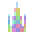

# Systems

<small>[Elite Tensura](../../index.md) &rsaquo; [Elite Tensura Codex](index.md)</small>

The wider mechanics of the Elite Tensura world.

##  Area Magicule

Every chunk in the world holds **area magicule** - a living resource that rises where strong beings gather and fades where they don't. High-magicule chunks regenerate everyone's magicule faster, grow rare crystals, and can spawn tougher monsters.

Off by default - a server enables it with the **ETMagiculeWorldSystem** gamerule.

**Entity Influence**

Any living being with enough magicule (**50,000+**) raises the area magicule of the chunk it's standing in over time, up to a cap.

That bonus spreads into neighboring chunks and slowly fades once nothing strong lingers - a chunk's magicule rises and falls with who's actually there.

**Crystal Growth**

In high-magicule chunks, Magic Ore has a chance to slowly convert into Mother Rock. Mother Rock then sprouts Magic Ore crystal buds that grow through four stages - Small, Medium, Large, then Cluster - each stage drawing more from the chunk's magicule.

**Stronger Spawns**

Natural mob spawns in very high-magicule chunks have a chance to be replaced by a tougher variant of the same monster.
  
Press **F8** to see a debug readout of the magicule in the chunk you're standing in.

## Boss Contribution

Calamities, the Leviathan raid and the season's finale siege all pay out by **damage share** - and until now you only learned yours when the rewards landed.
  
The **Boss Contribution** panel shows it live, while the fight is still on.

The moment you land a hit on the boss, a small panel appears on the right of your screen: the **top three** damage dealers, plus your own row if you are not among them, each with damage dealt and share of the total. It refreshes every **two seconds**.

**Reading It**

- A crown marks the current leader
- Your row is drawn in white, others in grey
- The bar under each row is that player's share of all damage so far
- Shares never shrink when the boss heals - they count lifetime damage, exactly as the payout does

**The Green Line**

In a **calamity**, rewards need **10%** of the boss's health. Your bar starts grey with a white tick at that mark; cross it and the bar turns **green** - you qualify.
  
Raids and sieges pay by share alone, so their bars simply take the event's colour: teal for the Leviathan, red for the siege.

**Notes**

- Only players who have damaged the boss see it - spectators never do
- Fighting two events at once? It follows whichever you hit last
- It fades about six seconds after the fight ends
- Move it from the mod list's **Config** button, under HUD Positions
- Servers can switch it off; there is no player toggle

## Chat Trivia &amp; Plushies

Every so often (about every **15 minutes**, and only while at least **6** players are online) the server asks a **question in chat**.
  
You have about **30 seconds** to answer by typing. The **first** correct answer wins - everyone else gets nothing that round.

Answers match as a *substring*, so a sentence containing the answer counts. Nobody has to type it exactly.

**Speed Decides**

Your reward depends entirely on **how fast** you answered:

- Within **5s** - **Elite Key**
- Within **15s** - **Rare Key**
- Any time after - **Common Key**

*That five-second window is the whole game. Speed matters far more than being the one who knew the answer.*

**Plushies**

Wins also earn **plushies**. Your **lifetime win count** unlocks tiers - the first plushie comes at **2** wins, then Uncommon at 8, Rare at 16, Epic at 25, Legendary at 30 - and every win from then on gives one random plushie:

- **Common** - 13 passive mobs
- **Uncommon** - 21, dolphins to iron golems
- **Rare** - 17 hostiles
- **Epic** - 15 nether and End mobs
- **Legendary** - 46, including the Ender Dragon, the Warden and the Tensura cast (Rimuru, Veldora, Velzard, Milim, Benimaru, Shuna, Shion, Souei, Hakurou, Kurobe, Diablo, Testarossa, Carrera, Ultima, Zegion, Apito, Kumara, Moss, Beretta, Ranga, Gobta, Gabiru, Treyni, Geld, Hinata, Guy Crimson, Leon, Luminous, Ramiris, Alvis, Albis, Suphia, Grucius, Eren, Gazel)
  
You always draw from your **highest** tier, so they get rarer as you win more.

**Collecting**

Plushies are decorative blocks - **114** variants, 112 of them in the trivia pools.

They are not craftable. Trivia is the main source, but **crates** roll them too - Common crates carry common plushies, Rare crates uncommon and rare ones, Elite crates epic and legendary (plus two crate-only extras).

If your inventory is full the plushie drops at your feet and can be picked up straight away.
  
Your win count is permanent and never resets.

##  Crates &amp; Keys

**Crates** are loot boxes in three tiers - **Common**, **Rare**, and **Elite**. Each tier only opens with its own key.
  
Right-click a crate while holding its key to open it. The key is consumed and a roulette of possible rewards spins down onto what you won.

**Checking the Odds**

Not sure what you might win? **Hit** a crate, or right-click it with an **empty hand** - either one opens a preview of every possible reward and its exact drop chance. No key needed, nothing spent.

**Rewards**

Crates can drop items, skills, or Soul Points - and sometimes even *more keys* for a higher tier. Elite Crates hold the rarest loot in the game.

**Rarity &amp; Pity**

Every reward has a rarity - **Common**, **Uncommon**, **Rare**, **Epic** or **Legendary** - shown as a coloured bar in the preview.
  
Open a Common Crate 15 times without anything Rare or better and the next open is **guaranteed** Rare+. The preview counts it down.

A guaranteed pull is marked **PITY** on the reveal. Keys found inside crates never count as a hit, and creative mode does not track pity.
  
Rare and Elite Crates hand out Rare+ most of the time, so they ship with pity off - servers can turn it on.

**The Reveal**

Higher rarities spin longer and climb through more colours before the flash. **Click anywhere** to skip straight to the result - you get the reward the moment it shows, skipped or not.
  
Epic and Legendary pulls set off fireworks at the crate for everyone nearby.

**Where Keys Come From**

Keys are not craftable. They come from other crates, **Calamity** payouts scaled by your contribution, and winning a **war** - every member of the winner gets a key, the top scorer a better one.

They also come from completing a **nation mission** (better still for clearing the whole cycle), chat trivia, and server events or admin grants.

*Each of the war, mission and calamity faucets can be toggled off by your server.*

## Death Recap

With engravings, synergies, nation perks, season twists and transformations all pulling on the same blow, *what actually killed me* stops being an easy question.

The **Death Recap** answers it. When you die, a panel appears in the corner of the death screen listing your **last 8 hits**, oldest first.

**Reading It**

Each line names what struck you, what kind of harm it was, and what the blow did:
- **5.0** - landed as it was
- **7.0 up 9.0** - something raised it
- **7.0 down 4.0** - something blunted it
- **negated** - it was turned aside entirely

Falling, drowning and fire show no attacker.

**What The Arrows Mean**

The arrow is the *whole* story of that blow - your resistances, your engravings, your synergies, the attacker's own gifts, whatever the season's twist is doing. It does not try to name which of them did what.

That is still enough. A hit landing at triple what you expected means something is feeding it. A defensive build showing no reduction at all is not working.

**Notes**

- It covers everything - mobs, bosses, other players, the world itself
- Turned-aside blows still show, marked **negated** - useful proof a defence fired
- It clears itself when you leave the screen, so it never shows you an old death

- There is no button and no key. It simply happens, unless your server has switched it off.

## Discord Bridge

When the server links a Discord, a **bridge** carries news between game and chat. It can post:
- World events - Calamities, awakenings
- Nation &amp; diplomacy news
- Player milestones - records, achievements
- In-game chat
- Death messages

**Two-Way Chat**

With the optional gateway bot running, messages typed in the linked Discord channel also appear **in-game** - a true two-way chat.
  
Everything here is controlled by the server and is off by default.

**Channel Commands**

Type these straight into the linked Discord channel - the bot answers, and the message itself never crosses into game chat:
- **!list** - who's online
- **!tps** - server performance
- **!uptime** - how long the server has run

- **!leaderboard [board] [n]** - top players, one board or all of them
- **!nation &lt;name&gt;** - a nation's level, population, territory, standing and recent history
- **!season** - the current season number and top nations
- **!player &lt;name&gt;** - a player's nation, titles and playtime this week

*A server may rename the command prefix, disable individual commands, or turn the bot off entirely.*

## Finale Siege

A season does not simply stop. When it is called to an end, the world throws one last battle at whoever is still standing - the **Finale Siege**.
  
Win it and the season closes with spoils. Lose it and the season closes anyway, with nothing.

**The Waves**

The siege is cried, then **10 minutes** pass so the living can gather.
  
**Four waves** of the undead follow. The first is **8** strong; each after adds **4** more and another quarter of health. A wave breaks early once **nine in ten** are dead, or after **5 minutes**.

The whole siege dies of old age after **45 minutes**.

**The Boss**

After the last wave comes the **Lich** or the **Gravebound Colossus**, chosen blind, at **x3** health and **x2** damage.
  
There is nothing to join. Fight what comes. The world counts every blow each of you lands, and remembers who struck the last one.

**Spoils**

If the boss falls:
- Top damage and the killer both take the **Siegebreaker** title
- Every wounder shares a **100 point** Legacy pool, split by damage, never less than 2
- Every nation that fought shares a **200 point** ladder pool

- The top **five** nations split **$50,000** in treasury
  
Nation spoils come from their own purse - being sworn to a nation never shrinks your own Legacy share.

**Failure**

If the clock runs out, or the last player logs off, the siege is lost. No title, no Legacy pool, no ladder points, no treasury.

The season still closes. Your Chronicle tiers, your leaderboard finishes and your nation's levels still become Legacy as always - only the siege's own spoils are forfeit.

##  Leaderboard

The **Leaderboard** ranks players by their feats and writes the results onto the vanilla **scoreboard**, so standings are always on display.
  
Tracked boards include Awakened/EP, prestige Resets, Titles, Records, Nations, and Forge mastery.

**Checking Standings**

Use */etleaderboard*:
- *awakened* - who has awakened, and their EP
- *resets* - prestige rankings
- *titles* / *records* / *nations*
- *forge* - crafting score &amp; rarity
- *gui* - open the leaderboard screen

**Staying Listed**

Leaderboards only show **active** players: you must have been online at least **5 hours** (server-configurable) during this week or the last to appear.

Time counts automatically while you play. Fall below the requirement and you drop off the boards until you're active again - your scores are never lost, only hidden.

## Legacy

Everything you build in a season is unmade when it ends - your EP, your skills, your nation. **Legacy is the exception.**

Legacy Points are kept outside the world itself, so they outlive the wipe and follow you into every season after. They buy **cosmetics** - badges, an aura, and a few display titles that carry only modest, uncommon-grade bonuses. Legacy is a keepsake, not a power ladder.

**Earning Points**

Paid once, at the season's close, for what you did:
- **10** per Chronicle tier completed
- **25** per top-three leaderboard slot held
- **2** per level your nation reached
- A share of **100** for damage dealt during the Finale Siege - waves and boss alike

A season where you cleared the Chronicle and topped a board is worth about 125 points. Most of the shop is several seasons deep.

**The Shop**

Codex, **Season** tab, **Legacy** section - your balance, what you own, what you wear.

Chat badges from **25** to **200** points, a pair of season-limited badges at **130**, three display titles from **90** to **220**, and one headline piece: the **Dawnrise Aura** at **350** - a glowing ring that plays every time you log in, sized to your character.
  
Servers may stock more.

**What You Keep**

Bought is **yours forever**. Plushies and titles are handed back to you each new season when you log in - a world wipe never costs you a purchase.
  
Badges sit beside your name in chat. Wear one at a time, or none.

Some cosmetics can only be *bought* during a certain season. That limit never touches what is already in your collection.

## Money &amp; Banking

If your server runs the **banking mod**, Elite Tensura ties into it.
  
Money becomes a real part of progression - it funds your nation's **treasury**, its levels and perks, war declarations, and the **contract board**.

*Without the banking mod none of this appears, and the rest of the addon works exactly as normal.*

**Cash from Mobs**

Certain mobs drop **extra cash** when killed, on top of their usual loot.
  
*Subordinates and summons are exempt* - nobody can farm tamed or summoned mobs for money.
  
Which mobs pay out is set by your server.

**Auto-Pickup**

Cash you pick up can be routed straight into your accounts instead of filling your inventory:

- **Off** - cash stays as items
- **Wallet** - goes to your wallet
- **Bank** - goes to your bank account

Pick your own mode with */etbank autopickup off\|wallet\|bank* - it starts on Off and remembers your choice. Bank falls back to Wallet if you have no primary account.

Auto-pickup also absorbs **money bills** dropped as items, whole bills only. The usual pickup popup can be suppressed by the server, so a long grind does not flood your screen.

**The Nation Tax**

If you belong to a nation with an active treasury, a slice of every cash pickup is taxed - drawn from your primary bank account, so no account means no tax:

- **5%** to your nation's treasury
- **10%** into the central bank reserve

The second is a **money sink** - it leaves the economy entirely, keeping server-wide currency from inflating.
  
Both halves are suspended while your nation runs a *Tax Holiday* perk.

## Season Mutators &amp; Titles

Every season rolls **one buff** and **one twist** when it starts. They hold for the whole season and bind everyone equally. The pair in force is shown in the **Season** tab of your Codex.

A mutator only rolls if the thing it touches is running - a calamity twist never appears where calamities are switched off.

**Kind Years**

- **Surge of Souls** - kill EP x1.5
- **Generous World** - daily rewards x2
- **Restless Ambition** - one extra daily
- **Prosperous Trade** - mission and contract pay x1.5
- **Forgemaster's Favor** - one free perfect forge stage per Minecraft day

- **Magicule Bloom** - the land's magicule regrows x1.5 (needs the Magicule World system)
- **Enlightened Age** - mastery gain x1.5
- **Golden Age** - mob cash x2

**Hard Years**

- **Magicule Drought** - the land's magicule regrows x0.5 (needs the Magicule World system)
- **Wrathful Calamities** - calamities x1.5 health, x1.25 damage
- **Heavy Crown** - nation upkeep x1.25
- **Cruel World** - hostile mobs +15% health, +10% damage

- **Demanding Chronicle** - daily targets x1.5
- **Age of Calamity** - calamities twice as often, one fewer player needed
- **Taxing Weave** - skill and magic costs x1.15

**Season Titles**

Thirteen titles can be earned **only** during a season, and most only under the twist that season rolled. A different twist simply never offers them. Two more - **Emberwrought** and **Second Dawn** - come from the top of the Second Dawn track.

- **Chronicler** - Bronze, Silver and Gold, for climbing the Chronicle deep
- **Drought-Blessed** - dailies cleared through the Drought
- **Iron Steward** - upkeep kept paid under a Heavy Crown

**Season Titles**

- **Relentless** - every daily cleared, days running, under a Demanding Chronicle
- **Worldbreaker** - a long tally of kills in a Cruel World
- **Weave-Hardened** - enduring the Taxing Weave
- **Wrathbreaker** - standing against Wrathful Calamities

- **Calamity's Bane** - slaying in the Age of Calamity
- **Siegebreaker** - topping the Finale Siege
  
The greatest are cried across the whole server. What exactly they ask is never written down - that is the point of them.

## Seasons

A **season** is a run of the world with its own ladder laid over everything else you do. You climb a **Chronicle** of tiers, clear daily objectives, and when it ends the best players and nations are paid - then the world wipes and the next one begins.

Off by default - a server enables it with the **ETSeasonSystem** gamerule. If the Season tab is missing, no season is running.

**Where To Look**

Open Tensura's main menu, click **Codex**, then the **Season** tab. It holds three things:
- **Chronicle** - your tier, its objectives, today's dailies
- **Legacy** - your points and the cosmetic shop
- **Nations** - the nation ladder standings

There is no season command for you to type. It is all in that tab.

**The Chronicle**

A ladder of tiers. Each names several objectives and you must meet **all** of them.
  
Progress is read from your *lifetime* totals - the world wipes each season, so your lifetime is your season.

You never claim a tier. Satisfy it and it awards itself, announces you in chat, and banks points for your nation.

**First Flames**

The default track runs ten tiers, climbing from Common Keys to Elite:
- **Awakening** - 500 kills, 5 biomes
- **Apprentice** - 10 forges, 100,000 EP, 5 records
- **Wayfarer** - 12 biomes, 5 structures
- **Blooded** - 8,000 kills, 5 titles

- **Veteran** - 10,000 kills, 10 titles
- **Calamity's Witness** - wound a calamity, 500,000 EP
- **Warforged** - 25 war kills, 50 forges
- **Ascending** - 5,000,000 EP, 15 records
- **Ascendant** - 50,000,000 EP, 25 records

- **Legend of the Season** - 250,000,000 EP, 3 calamities slain, 50 records, a war won

A second built-in track, **Second Dawn**, reshapes the ladder rather than simply raising it - gentler kill counts, an arena objective, two titles of its own, and an eleventh capstone tier for a tournament champion. Servers may run their own track entirely.

**Dailies**

**Two** objectives are rolled for you each day - kills, forges, biomes, structures, records or titles.
  
They reset at **midnight UTC**, not your local midnight and not with nation upkeep. Clearing one pays a **Common Key** and banks points for your nation.

There is no reroll. An uncleared daily is simply gone.

**The Nation Ladder**

Your season work scores for your nation too:
- Chronicle tier - **10** points
- Daily objective - **2**
- War won - **100**
- Finale Siege damage - a share of **200**
- Tournament champion - **50** to the winner's nation

Points are banked as you earn them, so changing nations never moves what you already earned. Nationless players simply score nothing - nothing is taken from you.

**The Close**

When a season ends, the **top three** on each leaderboard - EP, resets, titles, records, forging - each take an **Elite Key**. Top two boards and you are paid twice. Log off before the close and it waits for you.

Ladder standings are announced, everything you did converts to **Legacy Points**, and the world begins again.
  
If the **Finale Siege** is enabled, it is fought first.

##  Starfall

**Starfall** is a non-combat world event - a resource race, not a fight. The Voice warns you, a star falls, and whoever gets there first keeps what it drops.

On by default. A foreshadow gives a compass direction and rough distance; a burning meteor then streaks down - purely visual, no terrain damage.

**The Ore**

Impact leaves a small cluster of **Starfall Ore** on the surface. Mine it with a **diamond pickaxe or better** for **Star Iron** - Fortune raises the yield, Silk Touch bags the block.

Leftover ore evaporates **20 minutes** (default) after impact. Star Iron has no other source and no smelting recipe.

**Where It's Used**

Star Iron is a required ingredient on all eight **Aetherforged** weapon and armor recipes - see that entry.

**Cadence**

A Starfall can occur **3-8 hours** (default) after the last, needing at least **3 players online**. The site is usually near a random player, clear of spawn and claims.

**On the Map**

Once the sky warns you, a translucent wedge appears on the FTB Chunks large map, fanned out from world spawn toward the fall - the same rough direction and distance the Voice announced. The minimap shows a small star at its edge, pointing the same way.

After impact, both maps swap the wedge for an exact pin at the landing site, until the ore is swept away.
  
Turn these markers off for yourself in the mod's config if you'd rather not see them.

**Witnessing**

Being near the impact counts as witnessing it, ore or not. Enough witnesses earn the **Star-Touched** title and the **Stargazer** / **Star-Chaser** records.
  
Admins run it with */etadmin starfall*.

## The Codex

The **Codex** is this addon's one screen. Titles, synergies, records, your nation, its missions, the season, your personal stats and the server's event feed all live in it as tabs, so there is only ever one button to remember.

Open Tensura's main menu and click **Codex** in the upper right. It opens on **Titles**.

**The Tabs**

- **Titles** - what you have unlocked and what you wear, with a filter/sort overlay and lineage panel
- **Synergy** - completed combinations and near misses
- **Records** - your permanent milestones, by category

- **Nation** - level, treasury, achievements, standings, diplomacy, history
- **Missions** - the current nation cycle
- **Season** - Chronicle, Legacy and the nation ladder (hidden when no season system runs)

- **Stats** - your personal numbers: combat, war and calamity, exploration and more
- **Events** - the rolling server feed of calamities, wars, world-firsts and other happenings

**Searching**

**Titles**, **Records**, **Synergy** and **Events** each carry a search box above the list. Type to narrow it by name or by rarity.
  
What you type *stays* when you switch tabs or resize the window - you never lose a search by clicking away.

On Records, the search looks only inside the **category you are in**. If something you expect is missing, check the category first.

## The Gravebound Colossus

The **Gravebound Colossus** is a mountain of grave-stone and chain, rooted where it wakes. It carries **8000** health, heavy armor and a yellow boss bar.

It *never takes a step*. It cannot follow you, cannot reach your walls, and cannot break so much as a single block. Everything it does, it does from where it stands - and its reach is **48** blocks.

**Where It Rises**

The Colossus can arrive as a **World Calamity** - enabled with the **ETCalamityEnabled** gamerule - or be called deliberately by an admin.
  
It ignores the weak, stirring only for those of real strength or for anyone foolish enough to strike it first.

Do not try to move it. Pistons, teleports, every trick you know - it simply returns to its footing. There is no cliff to push it from.

**The Three Sigils**

Three sigils burn on its shield, and they are the whole battle.

- While any sigil stands, only **one fifth** of your damage reaches the Colossus. The rest is drunk by the sigil you are breaking.

- Shatter all three and it stands **Exposed** for **12** seconds, taking **double** damage.
- Then they reform, and it begins again.
  
Watch the boss bar - it shows how many sigils remain.

**Its Reach**

It answers every distance, so there is no safe one:

- A **shockwave** rolls out to **12** blocks, hurling back all it passes.

- A **spire** marks the ground beneath you, then erupts a heartbeat later - range will not save you.

Break it below **66%** health and it awakens two more torments: a **gravity well** that drags everything within **24** blocks toward it, and **sundered ground** that burns underfoot for **12** seconds where it scatters it. Fleeing will not save you from either.

**Breaking It**

Hold your strongest blows for the Exposed window - damage spent outside it is worth a fifth as much.
  
Never disengage. Left alone for **30** seconds it begins knitting itself back together at **2%** of its health every second, and your work is undone.

It is **stone, not undead**: Smite means nothing here, and poison, wither and hunger slide off it entirely.

**Ground Down**

Its blows grind through what should stop them. Where you carry a **nullification**, the Colossus drags it down to a mere **resistance** - you no longer take nothing, you take less. Barriers fare no better.

Those who have built for resistance still suffer least. They are simply no longer *untouchable*.

**Spoils**

It leaves no loot upon the ground.
  
Fell it as a Calamity and everyone who dealt a tenth of its health earns a Rare Key, the top dealer an Elite Key, and every damager a Potential Catalyst - the same as any world disaster.

## The Hollow Sovereign

**Vaelthorn, the Hollow Sovereign** is an undead knight-lich - a fallen paladin fused with necromancy, magicule leaking from the cracks in its broken plate. It is far tougher than an ordinary foe: **5000** health, heavy armor, and a purple boss bar.

It only stirs for the powerful. Weak souls it ignores; it rouses for anyone of great strength - or anyone who strikes it first.

**Where It Rises**

The Hollow Sovereign can arrive as a **World Calamity** - enabled with the **ETCalamityEnabled** gamerule - or be called deliberately by an admin.

When it wakes it climbs from the ground in a burst of soul-fire and announces itself to the world. Then it hunts. It fights on foot, blinking across the battlefield to close distance.

**Breaking It Down**

The Sovereign is built to outlast a beating. No single blow can ever strip more than **4%** of its health at once, so raw burst will not fell it.

- It raises the **dead** - while its servants live it shrugs off most damage. Cut them down first.

- It **drains the land** - where magicule pools thick, it heals fast. Fight it where the air is thin.
- It **feeds on wounds** - the harder it strikes you, the more it heals. Do not trade recklessly.

**Weaknesses**

It is **undead**: **holy** and **fire** sear it for extra harm, and Smite bites deep.
  
Beware its final trick - the first time you would kill it, it *refuses to die*, clawing back to life with fresh servants. Only the second death is true.

Its spirit can still be ground down directly - attacks that wound the soul slip past its guard.

**Spoils**

Lay it to rest and claim:
- The **Lichbane** title
- The **Lich Slayer** record

When it falls as a Calamity, everyone who dealt a tenth of its health earns a Rare Key, the top dealer an Elite Key, and every damager a Potential Catalyst - the same as any world disaster.

##  Title Synergies

Every title carries hidden **tags** (like combat, dragon, or soul). When the right mix of tags appears across your titles, a passive **Synergy** awakens - an extra bonus layered on top of your titles.

By default synergies read your **unlocked** titles, so even un-equipped ones count toward them.

**How They Match**

A synergy checks three things across your titles:
- **Coverage** - you hold its required tags (*all* of them, or *at least* a few)
- **Volume** - enough different titles carry those tags
- **Depth** - some demand several titles of the same tag

Meet all three and the synergy is satisfied.

**Enabling Synergies**

Synergies are **opt-in**. When you qualify it shows as *AVAILABLE* in the Codex Synergy tab - it does not switch on by itself.
  
Turn it on there, or with */etsynergy enable &lt;id&gt;*; review and manage with */etsynergy list* and */etsynergy disable &lt;id&gt;*.

You may run up to **3** synergies at once (configurable).

**Power &amp; Examples**

The harder a synergy is to reach, the stronger and rarer its reward:
- **Blooded Novice** - combat + monster, 3 titles
- **Pathfinder** - any 3 of exploration/survival/knowledge, 3 titles
- **Demon Lord's Aura** - demonic/leadership/combat, 5 titles

- **Sovereign of Ruin** - 4 dark tags across 6 titles

**Tag Vocabulary**

Collect titles across these tags to feed synergies.
  
**Primary:** combat, heroic, demonic, leadership, exploration, crafting, magic, survival, knowledge, monster

**Themes:** fire, ice, void, soul, dragon, oni, undead, predator, sage, elemental, holy, cursed, wealth, speed, nature

**Good to Know**

Synergies are live: change your titles and any you no longer qualify for switches off by itself.
  
Active bonuses re-apply when you log in. You can opt out of any synergy you dislike, and a server may require titles to be *equipped* (not just unlocked) to count.

##  Titles &amp; Synergies

**Titles** are honors you earn for your deeds. Equip a title to gain its passive **bonus** - attribute boosts, status effects, or special stats.
  
Open the **Titles** and **Synergy** tabs of the Codex from the Tensura main screen.

Off by default - a server enables it with the **ETTitleSystem** gamerule.

**Earning Titles**

The game watches your progress and unlocks a title the moment you meet *all* of its requirements - things like:
- Kills, EP, single-hit damage
- Biomes &amp; structures found, distance walked
- Skills held, mastered, or by type
- Awakening, alignment, other titles held

Some stay hidden until earned; some announce to the whole server.

**Slots &amp; Equipping**

Earning a title does not auto-equip it. You slot titles into a limited number of **slots**, and only equipped titles grant bonuses.
  
Slots = **3** base, +1 every **2 prestiges**, up to **10**.
  
Swap them freely to suit the moment.

**Rarities**

Nine rarities mark a title's prestige:
- Common, Uncommon, Rare, Epic
- Legendary, Mythic, Unique
- **Hardcore** &amp; **Cursed** - special
  
**Hardcore** titles ignore the slot limit and stay always-on.

**Showcase**

One equipped title is your **showcase** - other players see it floating above your head, colored by its rarity.
  
By default it auto-picks your highest-rarity equipped title (newest wins a tie) - and **Cursed** outranks everything.

Prefer another? Select any equipped title in the Titles tab and press **★ Pin** (**★ Unpin** returns to auto). The **◉** button in the top corner hides your title - **◌** means hidden, and hiding drops your pin.
  
A server option can also show it in the player list.

**Prestige &amp; Persistence**

When you prestige (reset), ordinary titles are wiped - you re-earn them as you grow again.
  
Exceptions stay with you:
- **Hardcore** - kept (re-enable after reset)
- **Cursed** - kept, but switched off

- Event titles - kept (cannot be re-earned)

**Evolution**

Many titles form **lineages** - Wanderer grows into greater Wanderers, Orc Footsoldier climbs toward Orc Disaster, the slayer lines end in an archbane.

When you unlock a successor, its predecessors are **consumed**: they leave your unlocked list, stop granting bonuses and free their slot. They still **count** as earned for every requirement, record, synergy and leaderboard, so evolving never sets you back.

Hardcore and Cursed titles are never consumed. The Titles tab shows each chain and what a title evolves into (hidden successors show as ???), and a **Title Evolved** line replaces the usual unlock announcement.

**Synergies**

Every title carries **tags** (combat, fire, dragon, soul...). When your titles share the right tags, a passive **Synergy** becomes available - switch it on from the Synergy tab or with */etsynergy enable*.

You can run a few at once (configurable) and opt out of any you dislike.
  
*A server option can require titles to be equipped, not just unlocked, to count.*

## Tournaments

A **Tournament** is a scheduled elimination PvP bracket fought at an **Arena Anchor** the server has placed - solo 1v1, **duo** 2v2, or full **nation squads**, whichever the admins pick for the event.

Nobody dies. A blow that would kill instead **benches** you at the arena edge - healed, untouchable, out of that match. Your side fights on until no one on a team is left standing; then everyone is healed to full and sent back where they were.

**Joining**

When one is announced, */ettournament join* (or right-click the anchor) puts you in; */ettournament leave* takes you out; */ettournament status* shows the bracket, your team and your next opponent.

Matches run **one at a time**: a short countdown, then the fight. Teammates cannot hurt each other; outsiders cannot touch fighters at all.
  
Flee the arena and a five-second grace runs before you are benched. If time runs out - **5 minutes** - the side that dealt more damage takes it.

**Duo &amp; Nation**

In a **duo** event, */ettournament partner &lt;player&gt;* picks your teammate - if they pick you back, you are locked in. Everyone else is paired up in signup order; an odd fighter out sits the event out.

In a **nation** event you must belong to a nation to enter, and its first few signups form the squad (usually **3** - the announcement says). A squad may fight short-handed.
  
Disconnect mid-match and you are only benched for that match; quit or vanish between matches and you are out of the bracket.

**Betting**

While signups are open, back a fighter with real money: */ettournament bet &lt;player&gt; &lt;amount&gt;*. Bet again to raise your stake, or bet on someone new to move it. */ettournament pool* shows the pot and the favourite.

The pool locks when the bracket seeds. Back a member of the winning team and you split the losing stakes in proportion to your bet, plus your own stake back - minus a **10%** house cut to the central bank.
  
If nobody backed the champion, or the event is called off, every coin comes back.

The champion earns no crate, no title, no Legacy - tournaments pay only into the **season**: every seeded fighter advances the Chronicle's tournament objectives, champions who stayed the distance count a win, and the champion's **nation** banks **50** ladder points (a duo only when both share a banner).

Every stage is announced in chat, on the overlay and in the Codex Events feed.

##  Voice of the World

The **Voice of the World** is the cinematic narrator. Great moments appear as an on-screen banner:
- Skill unlocks &amp; evolutions
- Title and Record unlocks
- World events - dungeons, monsters, Calamities

- World-first feats (announced to everyone)

**Tuning the Voice**

Shape how it speaks in the Voice settings:
- Turn the overlay on or off
- Echo messages to chat
- Play sounds
- Use the Minecraft narrator (accessibility)
- Stretch display time, or merge rapid messages into one banner

**Spoken Audio**

An optional **spoken-audio** layer can read announcements aloud, voiced by a text-to-speech service.
  
It is set up by the server and is entirely optional - the overlay works fine without it.

##  Walpurgis Council

The **Walpurgis** is a grand council of **Demon Lords**, held in its own dimension - a banquet hall with a dueling arena.
  
There the mightiest gather to claim land, name enemies and allies, recognise new Demon Lords, and settle great matters by vote.

Off by default - a server enables it with the **ETWalpurgisEnabled** gamerule. Only Demon Lords may take part.

**Convening**

Any Demon Lord may right-click a **Walpurgis Orb** to call a council; others answer by clicking the Orb too.
  
Once **3** Demon Lords have answered (within ~10 min), a portal opens and the banquet begins.

Missed the portal? Use */etwalpurgis teleport* while a council is active.

**The Agenda**

In the Agenda phase (~5 min), attendees submit **motions** with */etwalpurgis submit*. Motion types:
- Territorial Claim
- Declare Enemy / Declare Neutral
- Treaty
- New Demon Lord Recognition
- Expel Member
- Free Topic

**Filling the Form**

**Title** - required, cannot be left blank.
  
**Description** - free text for most motions. For a **Territorial Claim** it must be the two corners of the plot in block coordinates: *x1,z1 x2,z2*.

**Target Player** - appears for Declare Enemy, Declare Neutral, Expel Member, Treaty, and New Demon Lord Recognition. It's a hard requirement for Declare Enemy, Declare Neutral, and Treaty - the form won't let you submit without a name there.

**Working the Agenda**

A Demon Lord isn't limited to one motion - submit as many as you want while the Agenda phase is open.
  
Motions go to a vote in the order they were submitted.

The phase doesn't need to run its full ~5 minutes: once every attendee has submitted at least one motion, deliberation begins early. Otherwise the timer decides when submissions close.

**Deliberation**

Motions are voted on one at a time. Cast yours with */etwalpurgis vote aye\|nay\|abstain*.
  
A simple majority passes a motion.
  
Carrying the **Walpurgis Seal** makes your vote count **double** - the word of an elder carries weight.

**The Combat Clause**

A **tied** vote is settled by blood. The council opens a duel window - use */etwalpurgis challenge &lt;player&gt;* within **60s** to fight for the outcome.
  
Win and the motion passes; lose and it fails. If no one steps forward, the motion fails by default.

**Outcomes &amp; Aftermath**

Passed motions reshape the world:
- **Enemy** - the target is marked and hunted
- **Treaty** - a pact between two lords
- **Claim** - land recorded to its lord

If the proposer leads a Nation, the ruling ripples into nation diplomacy (war, alliance, or claim budget).
  
Then the council rests on cooldown (2.5 hours). Review standings with */etwalpurgis territories \| enemies \| treaties*.

##  World Calamity

A **World Calamity** is a rare disaster - a Tensura monster awakens swollen with power (**x3** health, **x2** damage), glowing and named *Calamity*. A purple boss bar marks the threat.

Off by default - a server enables it with the **ETCalamityEnabled** gamerule. Admins can also trigger one with */etadmin calamity start*.

**When &amp; Where**

Left enabled, a calamity strikes on its own every **2-6 hours**.
  
It rises within a nation's Walpurgis-claimed territory if any exist, otherwise near an unlucky player.

If it is not slain within **30 minutes** - or every player logs off - it recedes with no reward.

**The Quiet World**

A calamity will not rise for the weak or the absent.

- At least **two players** must be online with **100,000 EP** or more
- Nothing spawns within **125 blocks** of **0, 0** - the world spawn is protected

Fail either and the world waits, trying again a few minutes later. An admin who summons one by hand ignores the first rule, never the second.

**Endings Without Glory**

A calamity is bound to the living world, and cannot outlast it.
  
If the **last player logs off**, the beast is unmade. If the **server restarts** mid-fight, the calamity is gone when the world returns - no stray monster is ever left roaming.

No reward is paid for either. The clock simply begins again.

**Joining the Fight**

The boss bar appears to everyone within **96 blocks**. Rush in and deal damage - the game records how much *each* player contributes.
  
Calamities hit hard, so bring allies. Every blow counts toward your share of the spoils.

Once you have landed a hit, the **Boss Contribution** panel shows the top three damage dealers and your own standing live - see its own entry in this book.

**The Shield**

With enough players online, a calamity wears a **Resonance Shield** that shrugs off solo damage - while it holds, your hits deal **0**.
  
To shatter it, **several different players** must each strike within a short window. The boss then turns *vulnerable* for a spell before the shield reforms.

The boss bar shows the state and a breaker count like **2/3**. With only one player needed, there is no shield.

**Rewards**

Deal at least **10%** of the boss's health to qualify. On its defeat, qualifiers receive:
- A **Rare Key**
- The **Calamity Slayer** title
- A calamities-slain credit

The **top** damage dealer also earns an **Elite Key**. Every damager also pockets a **Potential Catalyst**. You must be online at the kill to collect.
  
No single hit counts for more than **50**, and with four or more players online no one player is credited more than a quarter of the boss's health - bring friends.

Nations that joined gain a world-event credit and reputation.

**The Fall**

When the calamity dies, the World narrates the victory and a chat banner names the fight's duration and its **top three** damage dealers.

Your rewards *drop at the death site* as glowing items only **you** can pick up - claim them before they fade. A pillar of light and a crack of lightning mark the spot.

## World Ledger

Almost everything you earn is yours alone, or your nation's. The **World Ledger** is the server's own tally - four counters that add up what *every* player has ever done.
  
Each time the world crosses a threshold, everyone who helped is paid.

**The Counters**

- **Kills** - every mob ever felled
- **Calamities slain** - every invasion put down
- **Items forged** - every forge success
- **Titles unlocked** - every title earned
  
Each has its own ladder of thresholds. It never resets.

**What A Tier Pays**

**Legacy Points**, split by share. Every tier carries a pool, and everyone with a count in it takes a slice in proportion to what they gave - a fifth of the kills, a fifth of the pool.
  
Contribute at all and you get at least **1** point.

You need not be online. Payouts follow your name, not your presence.
  
While a season runs, a second pool is banked to the **nation ladder** by nation share. Having no nation costs you no Legacy - only that half has nowhere to go.

**Watching It**

Codex, **Stats** tab, **World Ledger** group. Each counter shows the running total, the next threshold, and your own share of it - or *complete* once every tier is cleared.
  
The figure can trail the live total by up to a minute.

**When A Tier Lands**

The Voice of the World calls it out, a blue line is written into the Codex's **Events** feed, and it is posted to Discord if the server keeps one.
  
*The world has recorded 100,000 kills. Ledger tier II is written.*

**Fine Print**

- A tier pays **once, ever** - a reset can lower the total, but nothing is paid twice
- Pass two thresholds at once and both pay
- Added to an old world, it notes where things stand and pays nothing for the past
- Thresholds and pools are set by your server
