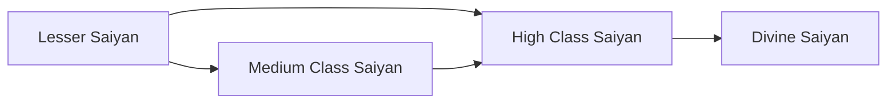

# High Class Saiyan

<small>[Elite Tensura](../index.md) &rsaquo; [Races](index.md)</small>

| | |
|---|---|
| **ID** | `elitetensura:high_saiyan` |
| **Stage** | In-between |
| **Difficulty** | Extreme |
| **Alignment** | Default |
| **Aura** | 40,000 - 40,000 |
| **Magicule** | 100,000 - 100,000 |
| **Health bonus** | 25 |
| **Spiritual health bonus** | 10 |
| **Attack damage bonus** | 3.75 |
| **Movement speed bonus** | 0.02 |
| **EP to evolve into** | 500,000 |

## Evolution

- **Evolves from:** [Medium Class Saiyan](medium-saiyan.md), [Lesser Saiyan](lesser-saiyan.md)
- **Evolves into:** [Divine Saiyan](divine-saiyan.md)
- **Default evolution:** [Divine Saiyan](divine-saiyan.md)
- **On awakening (True Demon Lord / True Hero):** [Divine Saiyan](divine-saiyan.md)

### Requirements to evolve into High Class Saiyan

Each requirement adds its weight to the evolution progress bar; you can evolve at 100%.

| Requirement | Weight |
|---|---|
| Reach Existence Points of 500,000 | 100% |

### Evolution tree

## Intrinsic skills

Granted automatically when you become this race.

-  [Dragon Eye](../../tensura-reincarnated/abilities/intrinsic-skills/dragon-eye.md)
-  [Dragon Skin](../../tensura-reincarnated/abilities/intrinsic-skills/dragon-skin.md)
-  [Dragon Ear](../../tensura-reincarnated/abilities/intrinsic-skills/dragon-ear.md)
-  [Body Armor](../../tensura-reincarnated/abilities/intrinsic-skills/body-armor.md)
-  [Charm](../../tensura-reincarnated/abilities/intrinsic-skills/charm.md)
-  [Sage](../../tensura-reincarnated/abilities/extra-skills/sage.md)
-  [Absorb &amp; Dissolve](../../tensura-reincarnated/abilities/intrinsic-skills/absorb-and-dissolve.md)

## Attribute modifiers

| Attribute | Amount | Operation |
|---|---|---|
| Scale | 0 | add |
| Max Health | 25 | add |
| Max Spiritual Health | 10 | add |
| Attack Damage | 3.75 | add |
| Attack Speed | 1 | add |
| Knockback Resistance | 0 | add |
| Movement Speed | 0.02 | add |
| Swim Speed Multiplier | 0 | add |

## Stats (config defaults)

Set in [`config/tensura/EliteTensura/Races.toml`](../configs/config-tensura-elitetensura-races.md).

| Option | Default | Description |
|---|---|---|
| `highSaiyan.minAura` | 40,000 | Minimal aura. |
| `highSaiyan.maxAura` | 40,000 | Maximum aura. |
| `highSaiyan.minMagicule` | 100,000 | Minimal magicule. |
| `highSaiyan.maxMagicule` | 100,000 | Maximum magicule. |
| `highSaiyan.size` | 0 | Bonus Size. |
| `highSaiyan.maxHealth` | 25 | Bonus Max Health. |
| `highSaiyan.maxSpiritualHealth` | 10 | Bonus Max Spiritual Health. |
| `highSaiyan.attack` | 3.75 | Bonus Attack Damage. |
| `highSaiyan.attackSpeed` | 1 | Bonus Attack Speed. |
| `highSaiyan.knockbackResistance` | 0 | Bonus Knockback Resistance. |
| `highSaiyan.movementSpeed` | 0.02 | Bonus Movement Speed. |
| `highSaiyan.swimSpeed` | 0 | Bonus Swimming Speed Multiplier. |
| `highSaiyan.epRequirement` | 500,000 |  |
| `mediumSaiyan.minAura` | 6,000 | Minimal aura. |
| `mediumSaiyan.maxAura` | 10,000 | Maximum aura. |
| `mediumSaiyan.minMagicule` | 12,000 | Minimal magicule. |
| `mediumSaiyan.maxMagicule` | 20,000 | Maximum magicule. |
| `mediumSaiyan.size` | 0 | Bonus Size. |
| `mediumSaiyan.maxHealth` | 12 | Bonus Max Health. |
| `mediumSaiyan.maxSpiritualHealth` | 5 | Bonus Max Spiritual Health. |
| `mediumSaiyan.attack` | 2 | Bonus Attack Damage. |
| `mediumSaiyan.attackSpeed` | 0.5 | Bonus Attack Speed. |
| `mediumSaiyan.knockbackResistance` | 0 | Bonus Knockback Resistance. |
| `mediumSaiyan.movementSpeed` | 0.01 | Bonus Movement Speed. |
| `mediumSaiyan.swimSpeed` | 0 | Bonus Swimming Speed Multiplier. |
| `mediumSaiyan.epRequirement` | 100,000 |  |
| `lesserSaiyan.epRequirement` | 0 | EP required to enter this race (starter tier — 0 = no gate). |
| `lesserSaiyan.minAura` | 2,000 | Minimal aura. |
| `lesserSaiyan.maxAura` | 3,000 | Maximum aura. |
| `lesserSaiyan.minMagicule` | 5,000 | Minimal magicule. |
| `lesserSaiyan.maxMagicule` | 6,000 | Maximum magicule. |
| `lesserSaiyan.size` | 0 | Bonus Size. |
| `lesserSaiyan.maxHealth` | 5 | Bonus Max Health. |
| `lesserSaiyan.maxSpiritualHealth` | 10 | Bonus Max Spiritual Health. |
| `lesserSaiyan.attack` | 0.5 | Bonus Attack Damage. |
| `lesserSaiyan.attackSpeed` | 0 | Bonus Attack Speed. |
| `lesserSaiyan.knockbackResistance` | 0 | Bonus Knockback Resistance. |
| `lesserSaiyan.movementSpeed` | 0 | Bonus Movement Speed. |
| `lesserSaiyan.swimSpeed` | 0 | Bonus Swimming Speed Multiplier. |
| `lesserSaiyan.learnableMagics` | "tensura:earth_lock", "tensura:liquidize", "tensura:fire_aspectual", "tensura:water_aspectual", "tensura:drainage", "tensura:wind_gust", "tensura:escape", "tensura:freeze" |  |
