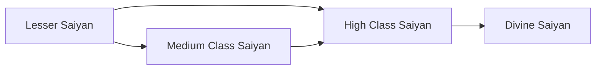

# Races

<small>[Elite Tensura](../index.md)</small>

Elite Tensura adds **4** races. Starting races can be chosen or rolled when you reincarnate; the rest are reached by evolving.

| Race | Difficulty | Alignment | Evolves into |
|---|---|---|---|
| [Divine Saiyan](divine-saiyan.md) | Extreme | Default |  |
| [High Class Saiyan](high-saiyan.md) | Extreme | Default | [Divine Saiyan](divine-saiyan.md) |
| [Lesser Saiyan](lesser-saiyan.md) | Extreme | Default | [Medium Class Saiyan](medium-saiyan.md) |
| [Medium Class Saiyan](medium-saiyan.md) | Extreme | Default | [High Class Saiyan](high-saiyan.md) |

## Evolution trees

### Lesser Saiyan line

