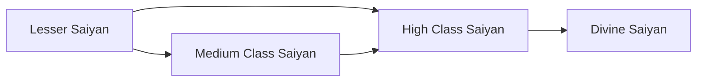

# Races

<small>[Elite Tensura](../index.md)</small>

Elite Tensura adds **4** races: **1** starting, **2** in-between and **1** final.

- **Starting:** the first race of its evolution line. Nothing evolves into it, so you get it by reincarnating into it or through a special item, skill or event.
- **In-between:** reached by evolving, and can evolve further.
- **Final:** the last step of its line. It does not evolve any further.

Races that link to other mods' races (for example an addon race that evolves from a Tensura race) are placed using the whole pack's evolution trees.

| Race | Stage | Difficulty | Alignment | Evolves from | Evolves into |
|---|---|---|---|---|---|
| [Divine Saiyan](divine-saiyan.md) | Final | Extreme | Default | [High Class Saiyan](high-saiyan.md) |  |
| [High Class Saiyan](high-saiyan.md) | In-between | Extreme | Default | [Lesser Saiyan](lesser-saiyan.md), [Medium Class Saiyan](medium-saiyan.md) | [Divine Saiyan](divine-saiyan.md) |
| [Lesser Saiyan](lesser-saiyan.md) | Starting | Extreme | Default |  | [Medium Class Saiyan](medium-saiyan.md), [High Class Saiyan](high-saiyan.md) |
| [Medium Class Saiyan](medium-saiyan.md) | In-between | Extreme | Default | [Lesser Saiyan](lesser-saiyan.md) | [High Class Saiyan](high-saiyan.md) |

## Evolution trees

### Lesser Saiyan line

