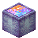

# Sack of Astral Dust

<small>[EnigmaticLegacy+](../index.md) &rsaquo; [Blocks](index.md)</small>

| | |
|---|---|
| **ID** | `enigmaticlegacyplus:astral_dust_sack` |
| **Tool** | Hoe |

## What it does

A storage block of 9 Astral Dust. It sparkles, and smelting it makes 4 [Astral Glass](astral-glass.md).

## Drops

| Item | Count | Chance | Notes |
|---|---|---|---|
|  [Sack of Astral Dust](astral-dust-sack.md) | 1 | 100% |  |

## Obtaining

### Recipes

**Crafting (shaped)** &rarr;  [Sack of Astral Dust](astral-dust-sack.md)

| | | |
|---|---|---|
|  [Astral Dust](../items/generic/astral-dust.md) |  [Astral Dust](../items/generic/astral-dust.md) |  [Astral Dust](../items/generic/astral-dust.md) |
|  [Astral Dust](../items/generic/astral-dust.md) |  [Astral Dust](../items/generic/astral-dust.md) |  [Astral Dust](../items/generic/astral-dust.md) |
|  [Astral Dust](../items/generic/astral-dust.md) |  [Astral Dust](../items/generic/astral-dust.md) |  [Astral Dust](../items/generic/astral-dust.md) |

### Loot

| Source | Count | Chance | Notes |
|---|---|---|---|
| Breaking [Sack of Astral Dust](astral-dust-sack.md) | 1 | 100% |  |

## Used in

[Astral Dust](../items/generic/astral-dust.md), [Astral Glass](astral-glass.md)

## Tags

`c:storage_blocks`, `minecraft:mineable/hoe`
