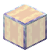

# Astral Glass

<small>[EnigmaticLegacy+](../index.md) &rsaquo; [Blocks](index.md)</small>

| | |
|---|---|
| **ID** | `enigmaticlegacyplus:astral_glass` |
| **Tool** | Pickaxe |

## What it does

Glowing glass (light 10, or 9 for panes). **Hit it or right-click it** (with anything but a block you could place) to cycle through 4 colour styles, or power it with redstone: the signal strength picks the style. Use **Astral Dust** on it to lock it into a shifting, colourful look for good. It tints beacon beams to match its style. Smelting an Astral Dust Sack gives 4 Astral Glass.

## Drops

| Item | Count | Chance | Notes |
|---|---|---|---|
|  [Astral Glass](astral-glass.md) | 1 | 100% |  |

## Obtaining

### Recipes

**Smelting** &rarr;  [Astral Glass](astral-glass.md) x4

Ingredients:  [Sack of Astral Dust](astral-dust-sack.md)

### Loot

| Source | Count | Chance | Notes |
|---|---|---|---|
| Breaking [Astral Glass](astral-glass.md) | 1 | 100% |  |

## Used in

[Astral Glass Pane](astral-glass-pane.md)

## Tags

`c:glass_blocks`, `minecraft:mineable/pickaxe`
