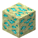

# Etherium Ore

<small>[EnigmaticLegacy+](../index.md) &rsaquo; [Blocks](index.md)</small>

| | |
|---|---|
| **ID** | `enigmaticlegacyplus:etherium_ore` |
| **Tool** | Pickaxe |
| **Tool tier** | Diamond |

## Drops

| Item | Count | Chance | Notes |
|---|---|---|---|
|  [Etherium Ore](etherium-ore.md) | 1 | 50% | Needs a specific tool |
|  [Raw Etherium](../items/miscellaneous/raw-etherium.md) | 1 | 50% |  |

## Obtaining

### Loot

| Source | Count | Chance | Notes |
|---|---|---|---|
| Breaking [Etherium Ore](etherium-ore.md) | 1 | 50% | Needs a specific tool |

## Used in

[Raw Etherium](../items/miscellaneous/raw-etherium.md)

## Tags

`c:ores`, `minecraft:mineable/pickaxe`, `minecraft:needs_diamond_tool`
