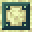
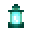

# Blocks

<small>[EnigmaticLegacy+](../index.md)</small>

EnigmaticLegacy+ adds **11** blocks.

| | Name | ID |
|---|---|---|
|  | [Astral Glass](astral-glass.md) | `enigmaticlegacyplus:astral_glass` |
|  | [Astral Glass Pane](astral-glass-pane.md) | `enigmaticlegacyplus:astral_glass_pane` |
|  | [Dimensional Anchor](dimensional-anchor.md) | `enigmaticlegacyplus:dimensional_anchor` |
|  | [Ethereal Lantern](ethereal-lantern.md) | `enigmaticlegacyplus:ethereal_lantern` |
|  | [Etherium Block](etherium-block.md) | `enigmaticlegacyplus:etherium_block` |
|  | [Etherium Ore](etherium-ore.md) | `enigmaticlegacyplus:etherium_ore` |
|  | [Sack of Astral Dust](astral-dust-sack.md) | `enigmaticlegacyplus:astral_dust_sack` |
|  | [Sack of Infernal Cinder](infernal-cinder-sack.md) | `enigmaticlegacyplus:infernal_cinder_sack` |
|  | [Spellstone Table](spellstone-table.md) | `enigmaticlegacyplus:spellstone_table` |
|  | [Starlight Block](starlight-block.md) | `enigmaticlegacyplus:starlight_block` |
|  | [The Eternal Cake](cosmic-cake.md) | `enigmaticlegacyplus:cosmic_cake` |
