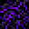

# Spellstone Table

<small>[EnigmaticLegacy+](../index.md) &rsaquo; [Blocks](index.md)</small>

| | |
|---|---|
| **ID** | `enigmaticlegacyplus:spellstone_table` |
| **Tool** | Pickaxe |
| **Tool tier** | Diamond |

## What it does

The crafting station for **spellstones**. Put Spellstone Debris in the left slot, a Spellcore in the middle and the recipe's seven ingredients around it, and the spellstone appears in the result slot (see each spellstone's page for its recipe). It also works the other way: put a spellstone alone in the right-hand slot to break it down into **4 Spellstone Debris**. Spellstone Huts have one.

## Drops

| Item | Count | Chance | Notes |
|---|---|---|---|
|  [Spellstone Table](spellstone-table.md) | 1 | 100% |  |

## Obtaining

### Recipes

**Crafting (shaped)** &rarr;  [Spellstone Table](spellstone-table.md)

| | | |
|---|---|---|
|   |  [Spellcore](../items/spellstones/spellcore.md) |   |
|  [Ender Pearl](https://minecraft.wiki/w/Ender_Pearl) |  [Ichor Droplet](../items/generic/ichor-droplet.md) |  [Ender Pearl](https://minecraft.wiki/w/Ender_Pearl) |
|  [Crying Obsidian](https://minecraft.wiki/w/Crying_Obsidian) |  [Crying Obsidian](https://minecraft.wiki/w/Crying_Obsidian) |  [Crying Obsidian](https://minecraft.wiki/w/Crying_Obsidian) |

### Loot

| Source | Count | Chance | Notes |
|---|---|---|---|
| Breaking [Spellstone Table](spellstone-table.md) | 1 | 100% |  |

## Tags

`minecraft:mineable/pickaxe`, `minecraft:needs_diamond_tool`
