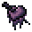
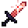
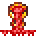
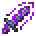
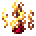
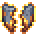
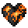

# Effects

<small>[EnigmaticLegacy+](../index.md)</small>

Status effects added by EnigmaticLegacy+.

| | Effect | Type | Description |
|---|---|---|---|
|  | [Abyss Corruption](abyss-corruption.md) | Harmful | A powerful negative buff that spreads with death. |
|  | [Blazing Might](blazing-might.md) | Beneficial | The effect will be removed after receiving any damage. |
|  | [Blessing of Starlight](starlight-blessing.md) | Beneficial | Etherium Threshold will increase damage dealt and restoring health when the effect ends. |
|  | [Chalice of Blood](blood-chalice.md) | Beneficial | Grants bonus damage based on the remaining duration of the effect. |
|  | [Curse of Mania](violence-curse.md) | Neutral | Temporary curses generated in battle. |
|  | [Curse of Penance](ichor-curse.md) | Neutral | The Nether will resonate with you. |
|  | [Ichor Corrosion](ichor-corrosion.md) | Harmful | Reduce your defense while increasing the damage you receive. |
|  | [Molten Heart](molten-heart.md) | Beneficial | Makes you immune to fire and grants you clear vision in lava. |
|  | [Poison](poison.md) | Harmful |  |
|  | [Pure Resistance](pure-resistance.md) | Beneficial | Reduce the damage received while having a chance to block damage. |
