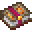
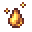

# Tome of Divination

<small>[EnigmaticLegacy+](../../index.md) &rsaquo; [Items](../index.md) &rsaquo; [Books](index.md)</small>

| | |
|---|---|
| **ID** | `enigmaticlegacyplus:bless_amplifier` |
| **Category** | Books |
| **Rarity** | Uncommon |

## Description

Hold and Right-Click on any enchanted item in inventory

to upgrade the enchantments on the item.

Can break the level limit.

## Obtaining

### Recipes

**Crafting (cursed)** &rarr;  [Tome of Divination](bless-amplifier.md)

| | | |
|---|---|---|
|  [Glowstone Dust](https://minecraft.wiki/w/Glowstone_Dust) |  [Ichor Droplet](../generic/ichor-droplet.md) |  [Glowstone Dust](https://minecraft.wiki/w/Glowstone_Dust) |
|  [Quartz](https://minecraft.wiki/w/Quartz) |  [Tome of Hungering Knowledge](enchantment-transposer.md) |  [Quartz](https://minecraft.wiki/w/Quartz) |
|  [Glowstone Dust](https://minecraft.wiki/w/Glowstone_Dust) |  [Sacred Crystal](../generic/sacred-crystal.md) |  [Glowstone Dust](https://minecraft.wiki/w/Glowstone_Dust) |

## Tags

`minecraft:bookshelf_books`
